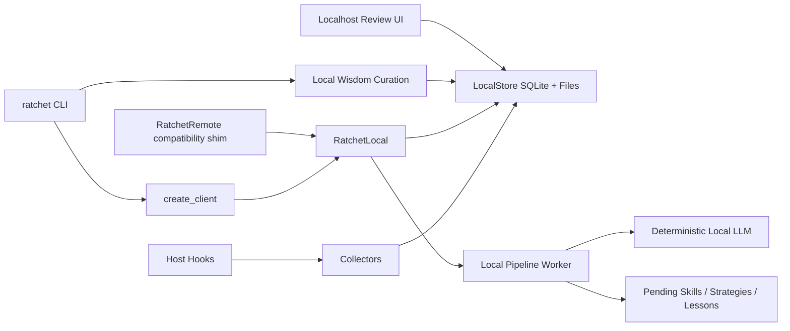

# Ratchet Architecture Overview

Ratchet is local-first infrastructure for turning Claude and Codex coding
sessions into reusable skills, strategies, lessons, and wisdom curations.



## Key Points

- `create_client(...)` always uses local behavior.
- `RatchetRemote` exists only for compatibility and delegates to
  `RatchetLocal`.
- Pipeline state, trajectories, generated artifacts, profile data, curations,
  and feedback are stored locally.
- Direct model-provider REST calls are not part of the runtime.
- Optional host-agent generation uses a local subprocess path, not Ratchet-owned
  HTTP requests.
- Remote skill archive downloads are disabled; skills install from local paths.
- Localhost review UI traffic is allowed for skill-enhancement feedback.

## Important Files

```text
ratchet/client/api/           client protocol, factory, compatibility shim
ratchet/pipeline/local_client.py
ratchet/pipeline/store.py
ratchet/pipeline/llm.py
ratchet/client/cli.py
ratchet/client/login.py
ratchet/client/skill_installer.py
skills/
hooks/
scripts/
```

## Configuration

Default local generation:

```yaml
llm:
  mode: deterministic
  generation_order:
    - deterministic
  embedding_order:
    - deterministic
  providers: {}
```

Optional host-agent generation:

```bash
ratchet configure --llm-mode host-cli --host-agent codex
```

## Public Compatibility

The public client methods remain available:

- `upload_trajectory`
- `trigger_pipeline_run`
- `get_pipeline_status`
- `get_outputs`
- `save_profile`
- `load_profile`
- `enhance_skill`
- `wisdom_curate`
- `wisdom_feedback`

Deprecated remote inputs are accepted as no-op compatibility values.
