# Ratchet Architecture

This document describes the architecture of Ratchet, an open-source Claude Code
plugin that collects interaction data, extracts reusable skills and strategies,
and optimizes AI workflows through a local-first runtime.

## 1. System Overview

Ratchet operates as a local-first runtime. The Ratchet service is not required for
normal pipeline or curation flows. User-controlled provider keys (`GEMINI_API_KEY`,
`OPENAI_API_KEY`) power embeddings and optional generation.

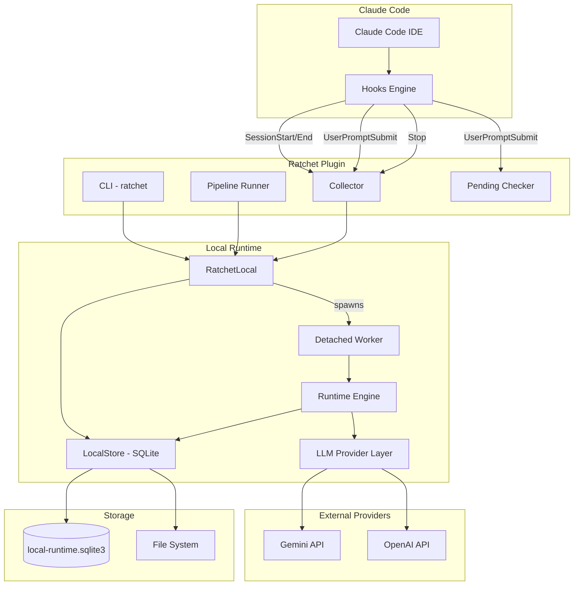

## 2. Package Structure

The codebase is organized into two main packages:

```
ratchet/
├── client/              # User-facing CLI, hooks, data collection
│   ├── api/             # Client factory, protocol, remote/sync adapters
│   ├── filters/         # Content filtering (paths, secrets)
│   ├── history/         # Multi-source session loading
│   │   └── sources/     # Claude, Codex, Gemini, Cursor, Parquet, etc.
│   ├── compaction.py    # Code block compaction for token reduction
│   ├── curation_store.py # File-based curation lifecycle persistence
│   ├── host_llm.py      # Host-agent LLM abstraction (subprocess-based)
│   └── utils/           # I/O, path, env, tracing helpers
├── pipeline/            # Local runtime engine
│   ├── local_client.py  # RatchetLocal implementation
│   ├── runtime.py       # Distillation, retrieval, curation logic
│   ├── store.py         # SQLite state store
│   ├── llm.py           # Provider abstraction (Gemini, OpenAI, Fake)
│   └── worker.py        # Detached pipeline worker entrypoint
hooks/                   # Claude Code hook definitions (hooks.json)
scripts/                 # Session startup scripts
skills/                  # Installed skill files
tests/                   # Test suite
```

## 3. Data Flow: Collection to Curation

The system operates as five connected loops:

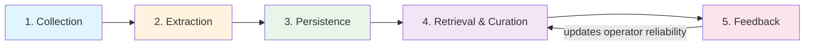

1. **Collection** -- Session data is normalized into `TurnSet` objects and persisted
   locally via `upload_trajectory()`.
2. **Extraction** -- `trigger_pipeline_run()` spawns a detached worker that runs the
   clustered closed-loop distiller: trace extraction, project/anchor clustering,
   success/error analyst JSON passes, deterministic proposal consolidation,
   cluster-level skill/strategy generation, operator synthesis, and PCR fragment
   persistence.
3. **Persistence** -- Rendered artifacts are written to the file system for human
   review; normalized state (artifacts, operators, PCR fragments, governance metadata)
   is written to SQLite.
4. **Retrieval & Curation** -- `wisdom_curate()` runs hybrid seed retrieval across
   procedure/context/outcome facets plus contextual lexical matching, fuses seeds with
   reciprocal-rank fusion (RRF), expands through operator edges using personalized
   PageRank, reranks with structural/env/feedback signals, and emits topologically
   ordered execution waves with compact per-step context packages.
5. **Feedback** -- `wisdom_feedback()` stores per-step causal feedback, writes
   per-step feedback events, and aggregates operator reliability/calibration metrics.
   `feedback_score` is derived from empirical evidence rather than free-text polarity.

## 4. Hook Integration

Ratchet integrates with Claude Code through its hooks system. Four hook events
drive data collection and skill delivery:

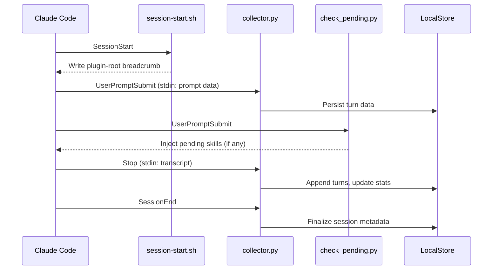

## 5. Client Architecture

### 5.1 Protocol and Factory

All client operations go through `RatchetBaseClient`, a Python `Protocol` class.
The factory always resolves to local mode:

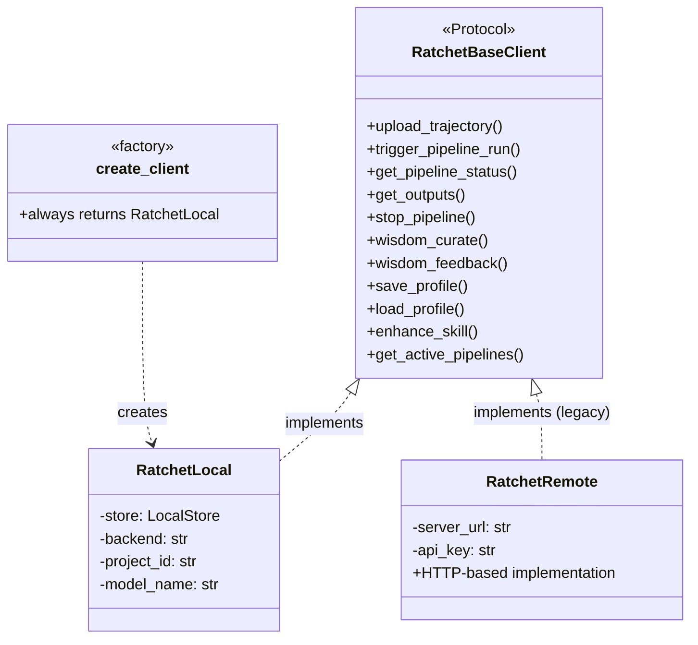

`create_client()` lazy-imports `RatchetLocal` inside the function body to avoid
import cycles (`profile -> api -> local_client -> profile`).

### 5.2 History Loading

The history system uses a pluggable `DataSource` protocol to load sessions from
multiple AI coding tools:

| Source | Module | Description |
|--------|--------|-------------|
| Claude Native | `sources/claude_native.py` | Claude Code JSONL sessions |
| Ratchet | `sources/ratchet.py` | Plugin-collected sessions |
| Codex | `sources/codex.py` | OpenAI Codex CLI |
| Cursor | `sources/cursor.py` | Cursor IDE sessions |
| Gemini | `sources/gemini.py` | Gemini CLI sessions |
| OpenCode | `sources/opencode.py` | OpenCode sessions |
| Parquet | `sources/parquet.py` | Dataset files (benchmarks) |

`DataLoader` aggregates sources and provides unified iteration via `iter_all()`.

## 6. Pipeline Run Lifecycle

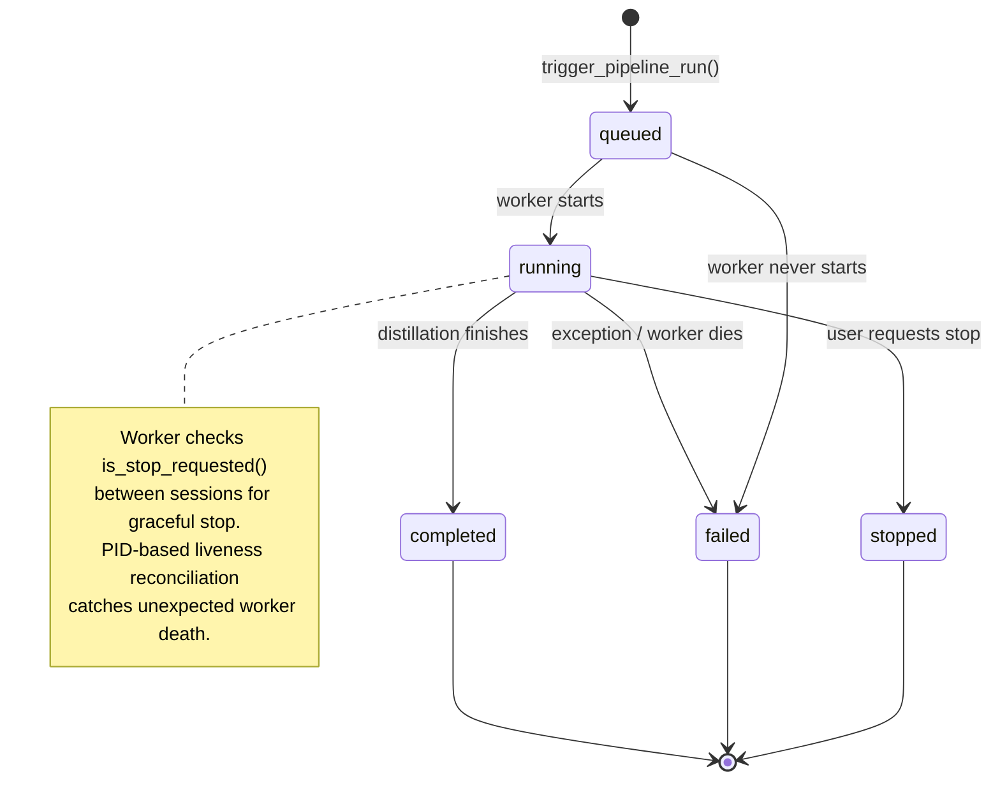

### 6.1 Triggering

`RatchetLocal.trigger_pipeline_run()`:
1. Checks for an active run on the same `project_id`.
2. If active and `force=False`: raises HTTP 409 for existing conflict handling.
3. If `force=True`: stops the existing run first.
4. Creates a `pipeline_runs` row with `status='queued'`.
5. Creates `~/.local/ratchet/runs/{project_id}/{run_id}/`.
6. Redirects worker stdout/stderr to `worker.log`.
7. Spawns a detached worker: `python -m ratchet.pipeline.worker --run-id <id>`.
8. Records the worker PID.

### 6.2 Worker Execution

The worker (`ratchet/pipeline/worker.py`) is intentionally minimal:
1. Marks run as started and stores PID.
2. Calls `run_local_pipeline(run_id)`.
3. Writes lifecycle events and worker log lines.
4. Writes terminal state (`completed`, `failed`, or `stopped`).

### 6.3 Status Reconciliation

`LocalStore.get_pipeline_status()` calls `_reconcile_row()` to handle workers that
disappear without writing terminal state. If a run is `queued` or `running` but its
PID is no longer alive, the row is rewritten to `failed`.

### 6.4 Traceability

Each run stores:

- `worker.log` for redirected worker stdout/stderr
- `events.jsonl` plus matching `pipeline_events` rows
- `llm/` prompt and response artifacts plus `pipeline_llm_calls` rows
- heartbeat fields on `pipeline_runs`

Debugging starts with:

```bash
ratchet debug
ratchet debug --run-id <RUN_ID>
ratchet debug-bundle --run-id <RUN_ID>
```

## 7. Clustered Distillation Pipeline

The distiller converts raw session data into retrievable knowledge through a
multi-stage clustering and analysis pipeline:

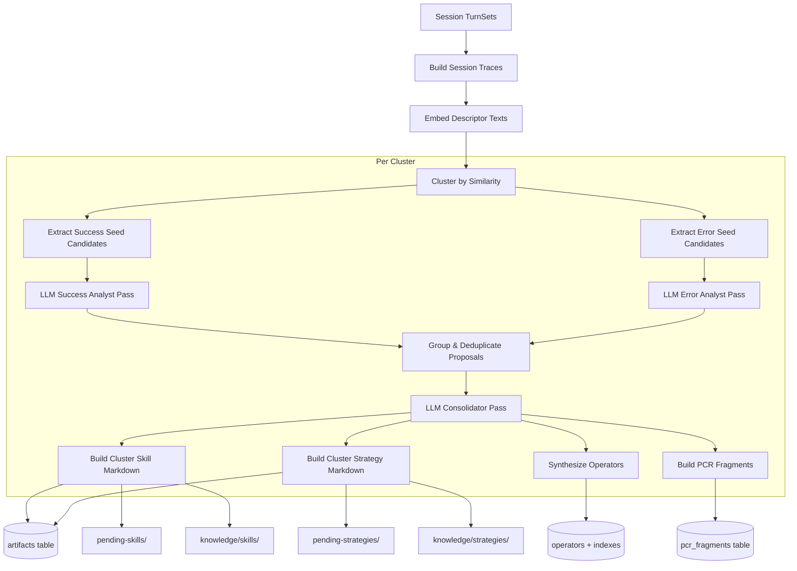

### 7.1 Trace Extraction

Each session is converted into a `SessionTrace` containing:
- Keyword frequency analysis
- Dominant tool identification
- Referenced paths and environment variables
- Environment fingerprint (language, frameworks, package manager, branch)
- Success steps, error windows, and correction windows
- Descriptor text and embedding for clustering

### 7.2 Session Clustering

Traces are clustered via connected components with similarity thresholds:
- **Similarity metric**: 0.6 × cosine(descriptor embeddings) + 0.25 × Jaccard(tools) + 0.15 × Jaccard(paths)
- **Hard constraints**: sessions with different languages or package managers cannot cluster
- **Anchor mode**: when a `session_id` is specified, only the cluster containing that session is emitted

### 7.3 Analyst Passes

Two structured LLM passes analyze each cluster:
- **Success Analyst** -- reviews successful workflow steps, bucketed by target
  (`canonical_workflow` or `verification_loop`)
- **Error Analyst** -- reviews correction patterns, failure guards, retry/stop signals

Both passes return JSON proposals that are then grouped by semantic similarity
(cosine >= 0.84) and deduplicated by support count.

### 7.4 Consolidator Pass

A final LLM pass produces a `_ConsolidatedCluster` containing:
- Summary and applicability rules
- Canonical workflow steps with evidence and support counts
- Verification loop, failure guards
- Strategy sections (delta rules, correction patterns, retry/stop signals)
- Memory fragments for PCR persistence

### 7.5 Governance

Every distilled artifact (skill, strategy, PCR fragment, operator) receives a
governance record:

| Field | Values | Purpose |
|-------|--------|---------|
| `validation_level` | `observed`, `verified`, `reproduced` | Maturity of evidence |
| `trust_tier` | `provisional`, `trusted`, `hardened` | Derived trust level |
| `safety_gate_status` | `approved`, `review_required`, `blocked` | Reuse eligibility |
| `safety_gate_reason` | Free text | Why the gate resolved that way |
| `content_digest` | SHA-256 | Drift detection |
| `provenance_json` | JSON object | Source sessions, test artifacts, rollback lineage, revalidation triggers |

## 8. Operator Graph

Operators are the primary retrieval and execution-planning units. Each operator
represents a step-level knowledge unit with rich structural metadata:

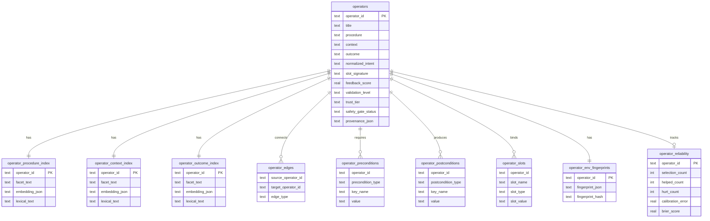

### Edge types
- **`depends_on`** -- sequential ordering (previous step must complete)
- **`requires_context`** -- analysis step established execution context
- **`supersedes`** -- marks an older operator as replaced
- **`conflicts_with`** -- mutual exclusion during retrieval

## 9. Retrieval and Curation

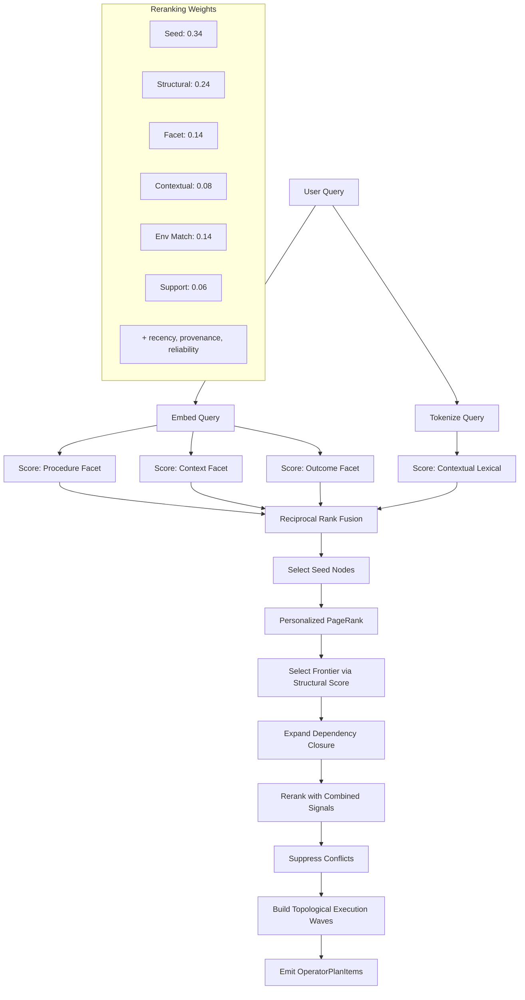

### 9.1 Governance Gate

Before ranking, operators pass a dynamic governance check:
- `observed` knowledge defaults to `review_required`
- Source-artifact digest drift can downgrade an otherwise approved operator
- Package-manager or language drift triggers revalidation
- Repeated harmful or abstention feedback can hard-block reuse

Only operators that pass the safety gate are eligible for retrieval.

### 9.2 Seed Selection

Each eligible operator is scored independently across four dimensions:
- Procedure facet (semantic + BM25 lexical)
- Context facet (semantic + BM25 lexical)
- Outcome facet (semantic + BM25 lexical)
- Contextual lexical overlap (operator-level BM25 including dependency titles)

The top-ranked operators from each dimension are fused using RRF to produce seed
nodes.

### 9.3 Structural Expansion

From seeds, personalized PageRank diffuses scores through `depends_on` and
`requires_context` edges. Operators above a structural floor threshold are added
as frontier nodes. The full dependency closure is then expanded to ensure all
prerequisites are included.

### 9.4 Topological Wave Planning

Selected operators are arranged into dependency-respecting execution waves:
- Earlier waves establish required context or prerequisites
- Later waves carry dependent execution steps
- Operators in the same wave may be marked `parallelizable`
- Missing preconditions or slots change readiness status to `blocked`

### 9.5 Abstention

The system can abstain from recommending operators when:
- No operators survive governance gating
- All top candidates have insufficient calibrated evidence
- Best predicted success is below 0.42
- Best confidence is below 0.45

## 10. LLM Provider Layer

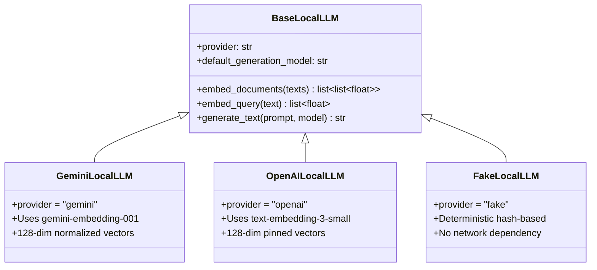

Provider selection order in `create_llm_client()`:
1. `RATCHET_TEST_FAKE_LLM=1` -- deterministic test provider
2. `GEMINI_API_KEY` -- Gemini REST provider
3. `OPENAI_API_KEY` -- OpenAI REST provider
4. Otherwise -- raises `LocalLLMError`

All providers normalize embeddings to 128 dimensions for SQLite storage compatibility.

## 11. Storage Architecture

### 11.1 Storage Layout

```
~/.local/ratchet/                 # RATCHET_DATA_DIR override
├── local-runtime.sqlite3            # Runtime state database
├── .env                             # Credential store
├── profile.json                     # User profile
├── plugin-root                      # Breadcrumb to plugin directory
├── runs/{project_id}/{run_id}/       # Worker logs, events, LLM artifacts
├── projects/{project_id}/
│   └── {session_id}/
│       ├── turns.jsonl              # Normalized turn data
│       ├── metadata.json            # Session metadata
│       └── stats.json               # Session statistics
├── knowledge/
│   ├── skills/{name}/SKILL.md       # Rendered skill sources
│   └── strategies/{name}/{name}.md  # Rendered strategy sources
├── curations/
│   ├── pending/                     # Curated but not yet executed
│   ├── running/                     # Currently executing
│   └── completed/                   # Finished curations
├── data/
│   ├── pending-skills/              # Awaiting user review
│   └── pending-strategies/          # Awaiting user review
└── skills/                          # Installed skills
```

### 11.2 SQLite Schema

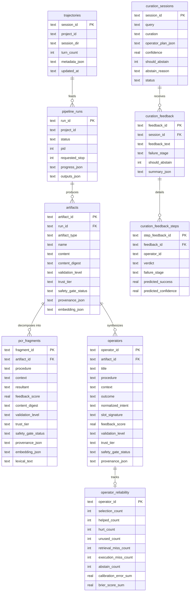

## 12. Feedback Loop

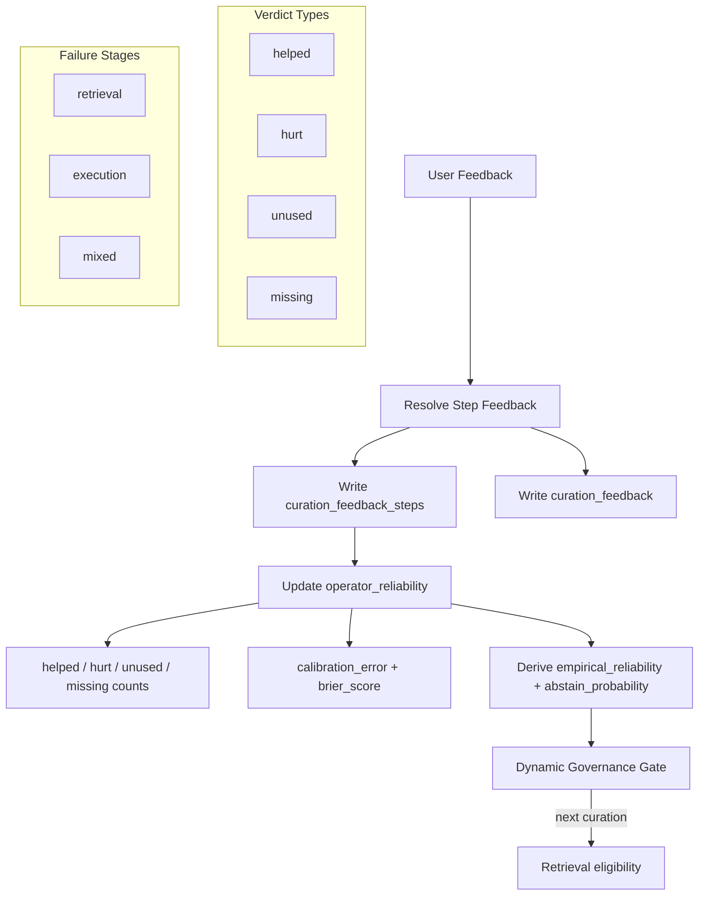

Per-step causal feedback marks individual operators as `helped`, `hurt`, `unused`,
or `missing`. Misses are attributed to `retrieval`, `execution`, or `mixed` failure
stages. Reliability aggregates track calibration error and Brier score.
`operators.feedback_score` is a derived compatibility score from these reliability
metrics rather than a direct text-sentiment delta.

## 13. Skill Installation

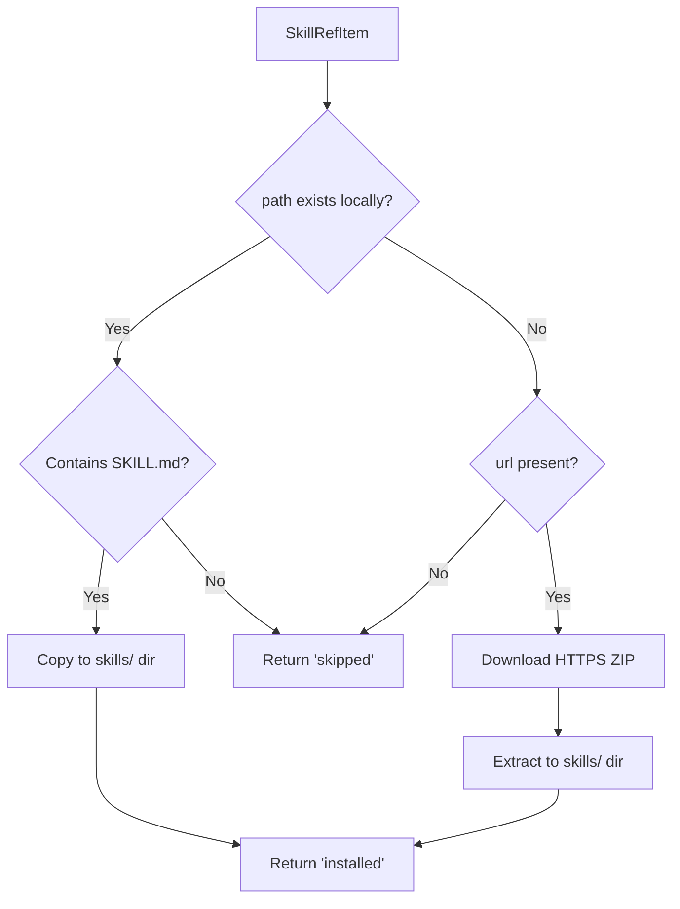

The installer supports both local source paths (from the local runtime) and
remote HTTPS ZIP archives (legacy server mode), enabling fully offline operation
apart from provider API calls.

## 14. CLI Commands

The `ratchet` CLI (`ratchet/client/cli.py`) provides:

| Command | Description |
|---------|-------------|
| `status` | Check plugin installation, provider keys, session counts |
| `configure` | Set provider API keys and client options |
| `login` | Legacy shim -- points to `configure` for local setup |
| `profile` | View or update user profile (language, level, style) |
| `pipeline-status` | Show active or recent runs with run dirs and heartbeat age |
| `pipeline-inspect` | Show timeline events, failure summary, LLM calls, and artifact paths |
| `pipeline-logs` | Tail or follow a run's `worker.log` |
| `debug` | Collect local run evidence and write a debug bundle directory |
| `debug-bundle` | Create a raw directory with run evidence |

Pipeline operations are run through the hook system and `run_pipeline.py`:
- `wisdom-gen` -- trigger pipeline, poll status, save outputs
- `wisdom-curate` -- retrieve and rank knowledge for a query
- `wisdom-feedback` -- submit feedback on curated results

## 15. Testing

| Test File | Coverage |
|-----------|----------|
| `test_local_runtime.py` | Full lifecycle: ingest, pipeline, curation, feedback, stop, install |
| `test_local_setup.py` | Provider key validation |
| `test_pipeline_constraints.py` | Pipeline configuration constraints |
| `test_shared_env.py` | Shared environment variable handling |
| `test_operator_graph.py` | Operator graph: facet retrieval, governance gating, PageRank, wave planning, causal feedback |
| `test_runtime_cli_integration.py` | End-to-end CLI: pipeline, curate, install, feedback, reranking |
| `test_hook_contracts.py` | Hook execution paths and contracts |
| `test_skill_wrappers.py` | Skill enhancement and wrapping |
| `test_plugin_contracts.py` | Plugin integration contracts |

Tests use `FakeLocalLLM` for deterministic, network-free execution that validates
ranking, persistence, and feedback behavior without provider dependencies.

## 16. Known Limitations

- Distillation uses heuristic clustering and structured LLM passes, not learned models
- PCR generation is consolidator-derived rather than fully model-generated
- Feedback weighting is heuristic
- Dependency graphs are shallow and mostly sequential
- Retrieval is exact (SQLite-backed), not ANN-backed
- Generation is lightly used in the local pipeline

These are acceptable trade-offs for a local-first OSS runtime that provides
clustered distillation, async runs, durable state, a safety-gated operator graph,
topological wave planning, cheatmap generation, and a causal feedback loop.
