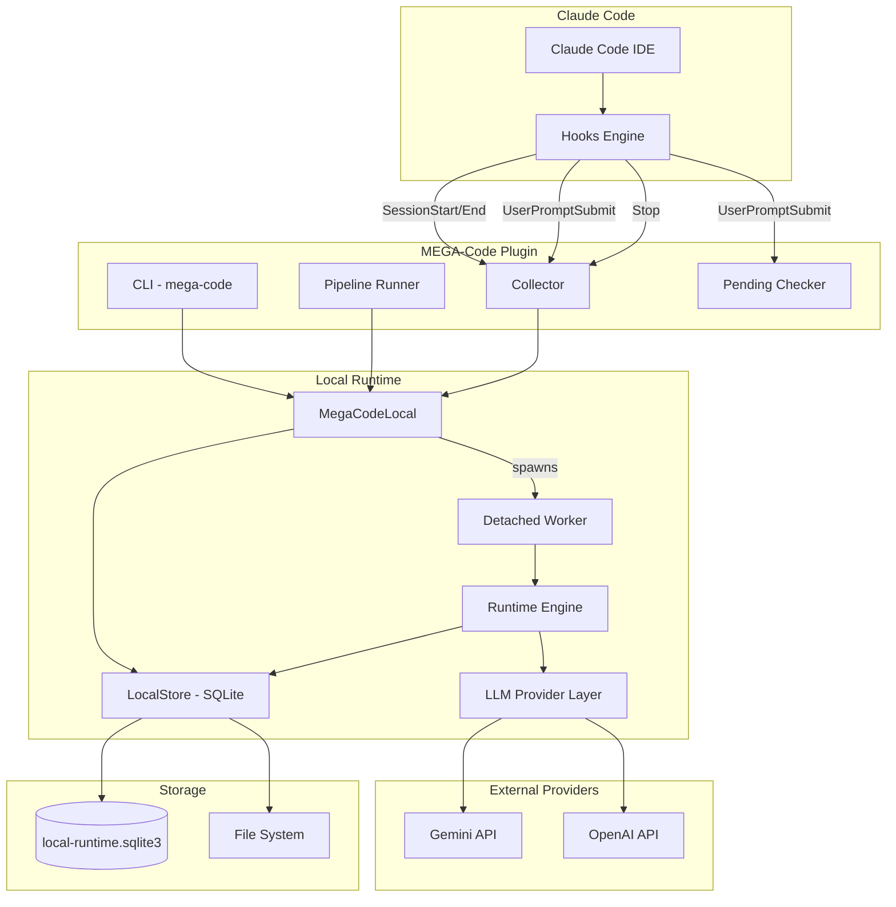
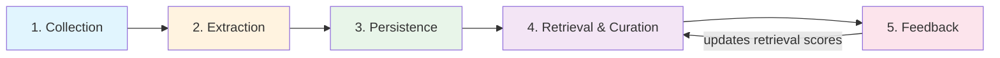
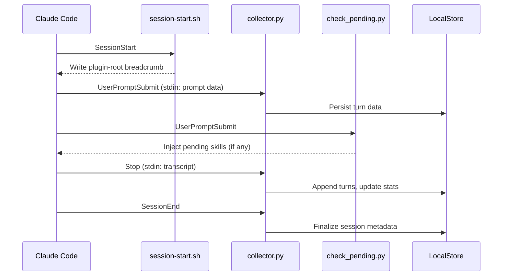
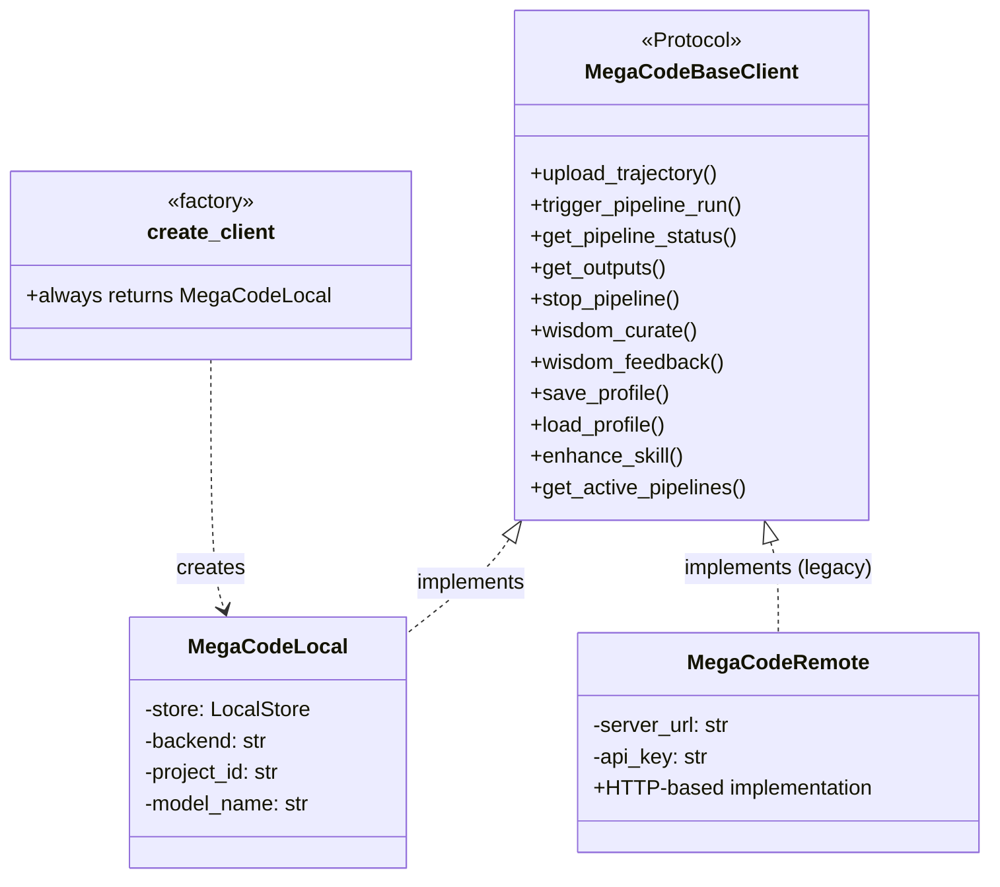
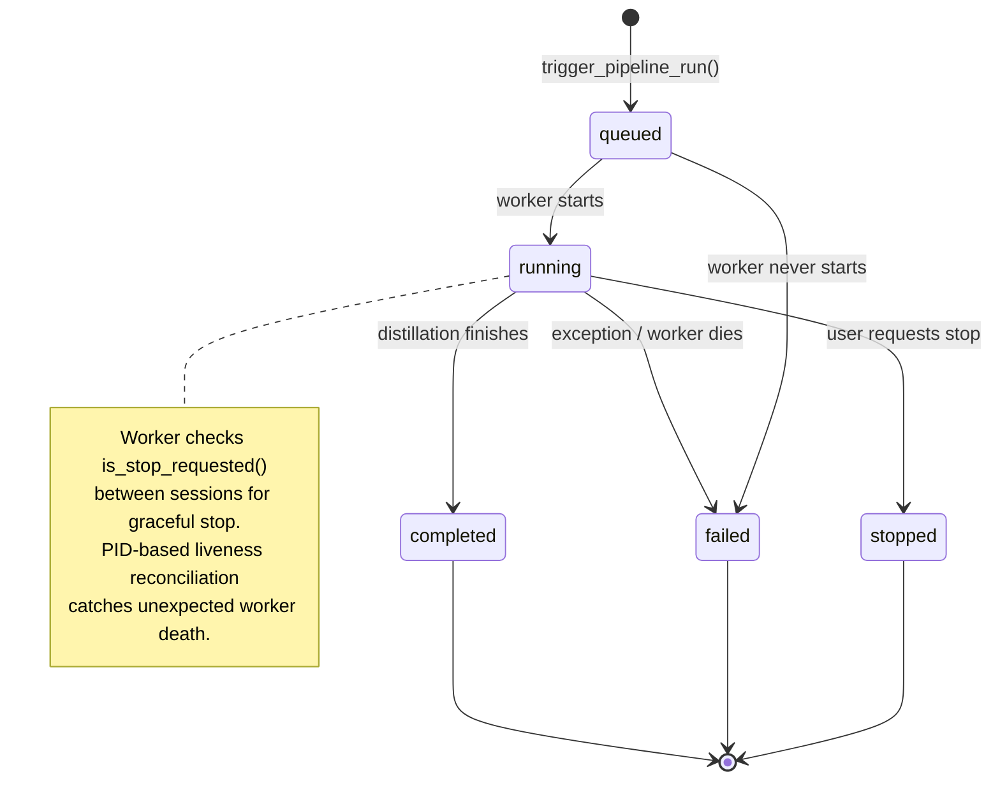
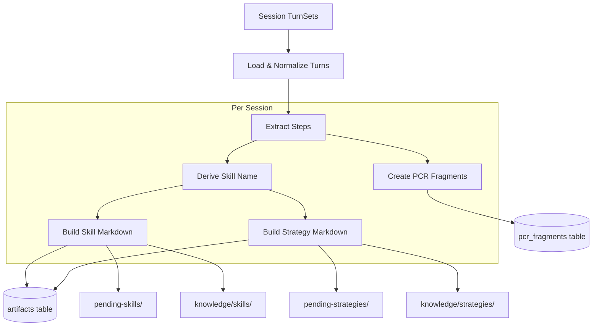
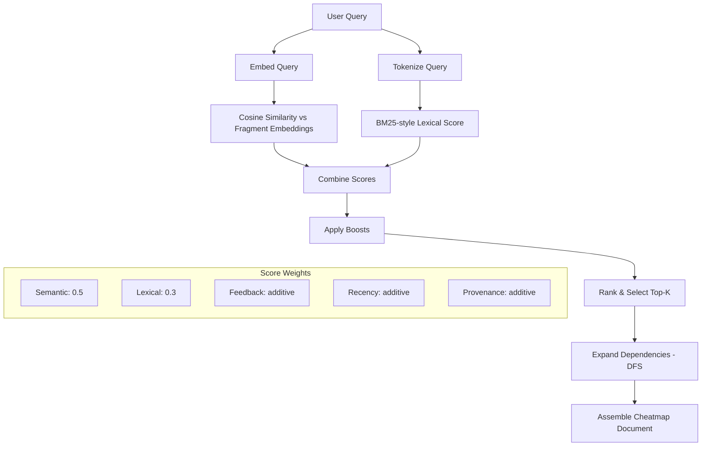
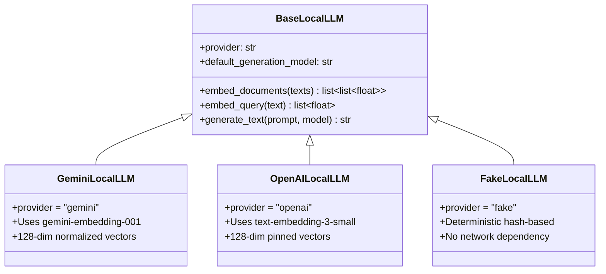
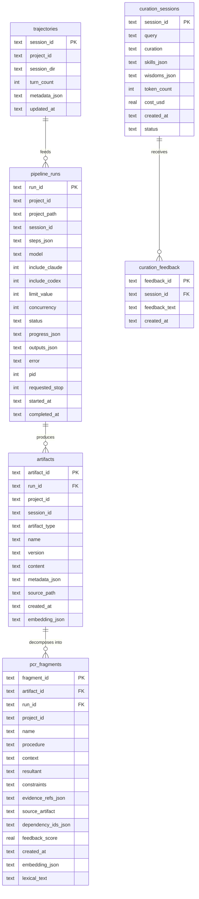
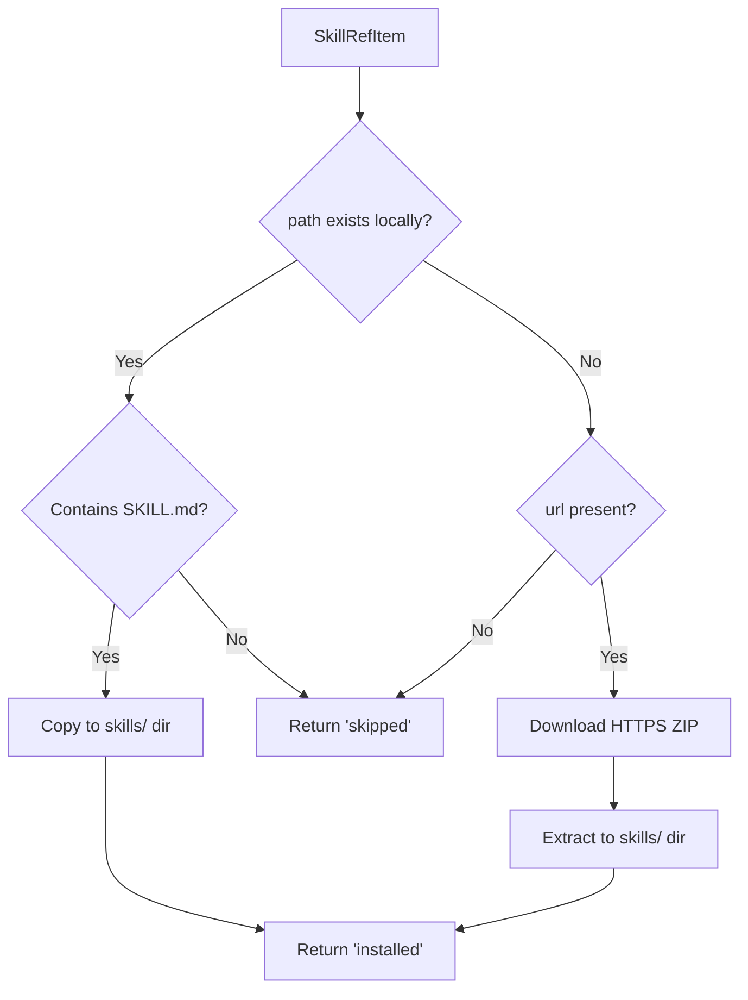

# MEGA-Code Architecture

This document describes the architecture of MEGA-Code, an open-source Claude Code
plugin that collects interaction data, extracts reusable skills and strategies,
and optimizes AI workflows through a local-first runtime.

## 1. System Overview

MEGA-Code operates as a local-first runtime. The MEGA service is not required for
normal pipeline or curation flows. User-controlled provider keys (`GEMINI_API_KEY`,
`OPENAI_API_KEY`) power embeddings and optional generation.



## 2. Package Structure

The codebase is organized into two main packages:

```
mega_code/
├── client/              # User-facing CLI, hooks, data collection
│   ├── api/             # Client factory, protocol, remote/sync adapters
│   ├── filters/         # Content filtering (paths, secrets)
│   ├── history/         # Multi-source session loading
│   │   └── sources/     # Claude, Codex, Gemini, Cursor, Parquet, etc.
│   └── utils/           # I/O, path, env, tracing helpers
├── pipeline/            # Local runtime engine
│   ├── local_client.py  # MegaCodeLocal implementation
│   ├── runtime.py       # Distillation, retrieval, curation logic
│   ├── store.py         # SQLite state store
│   ├── llm.py           # Provider abstraction (Gemini, OpenAI, Fake)
│   └── worker.py        # Detached pipeline worker entrypoint
hooks/                   # Claude Code hook definitions (hooks.json)
scripts/                 # Session startup scripts
skills/                  # Installed skill files
tests/                   # Test suite
```

## 3. Data Flow: Collection to Curation

The system operates as five connected loops:



1. **Collection** -- Session data is normalized into `TurnSet` objects and persisted
   locally via `upload_trajectory()`.
2. **Extraction** -- `trigger_pipeline_run()` spawns a detached worker that distills
   sessions into pending skills, strategies, and PCR fragments.
3. **Persistence** -- Rendered artifacts are written to the file system for human
   review; normalized state is written to SQLite.
4. **Retrieval & Curation** -- `wisdom_curate()` ranks PCR fragments via hybrid
   semantic + lexical scoring, expands dependencies, and assembles an ordered cheatmap.
5. **Feedback** -- `wisdom_feedback()` stores user feedback locally and updates
   fragment scores, improving subsequent retrievals.

## 4. Hook Integration

MEGA-Code integrates with Claude Code through its hooks system. Four hook events
drive data collection and skill delivery:



## 5. Client Architecture

### 5.1 Protocol and Factory

All client operations go through `MegaCodeBaseClient`, a Python `Protocol` class.
The factory always resolves to local mode:



`create_client()` lazy-imports `MegaCodeLocal` inside the function body to avoid
import cycles (`profile -> api -> local_client -> profile`).

### 5.2 History Loading

The history system uses a pluggable `DataSource` protocol to load sessions from
multiple AI coding tools:

| Source | Module | Description |
|--------|--------|-------------|
| Claude Native | `sources/claude_native.py` | Claude Code JSONL sessions |
| MEGA-Code | `sources/mega_code.py` | Plugin-collected sessions |
| Codex | `sources/codex.py` | OpenAI Codex CLI |
| Cursor | `sources/cursor.py` | Cursor IDE sessions |
| Gemini | `sources/gemini.py` | Gemini CLI sessions |
| OpenCode | `sources/opencode.py` | OpenCode sessions |
| Parquet | `sources/parquet.py` | Dataset files (benchmarks) |

`DataLoader` aggregates sources and provides unified iteration via `iter_all()`.

## 6. Pipeline Run Lifecycle



### 6.1 Triggering

`MegaCodeLocal.trigger_pipeline_run()`:
1. Checks for an active run on the same `project_id`.
2. If active and `force=False`: raises HTTP 409 for existing conflict handling.
3. If `force=True`: stops the existing run first.
4. Creates a `pipeline_runs` row with `status='queued'`.
5. Spawns a detached worker: `python -m mega_code.pipeline.worker --run-id <id>`.
6. Records the worker PID.

### 6.2 Worker Execution

The worker (`mega_code/pipeline/worker.py`) is intentionally minimal:
1. Marks run as started and stores PID.
2. Calls `run_local_pipeline(run_id)`.
3. Writes terminal state (`completed`, `failed`, or `stopped`).

### 6.3 Status Reconciliation

`LocalStore.get_pipeline_status()` calls `_reconcile_row()` to handle workers that
disappear without writing terminal state. If a run is `queued` or `running` but its
PID is no longer alive, the row is rewritten to `failed`.

## 7. Distillation Pipeline

The distillation process converts raw session data into retrievable knowledge units:



### 7.1 Step Extraction

`_collect_steps()` scans turns in priority order: commands, tool calls, then
assistant reasoning. Steps are deduplicated and capped.

### 7.2 PCR Fragment Creation

Each step becomes a PCR (Procedure-Context-Resultant) fragment with:
- **Procedure**: normalized step label
- **Context**: project path, branch, model
- **Resultant**: evidence snippet from the session
- **Constraints**: execution guardrails
- **Dependencies**: previous step fragment (forms a shallow dependency graph)
- **Embedding**: provider-generated vector
- **Lexical text**: flattened text for BM25-style ranking

## 8. Retrieval and Curation



The ranking pipeline is hybrid and fully local:
1. Embed the query using the configured LLM provider.
2. Compute cosine similarity against all fragment embeddings.
3. Compute BM25-style lexical scores against fragment text.
4. Normalize each score dimension independently.
5. Apply boosts for feedback history, recency, and provenance.
6. Select top-K seeds and expand their dependency chains via DFS.
7. Assemble an ordered cheatmap document with procedures, context, and scores.

## 9. LLM Provider Layer



Provider selection order in `create_llm_client()`:
1. `MEGA_CODE_TEST_FAKE_LLM=1` -- deterministic test provider
2. `GEMINI_API_KEY` -- Gemini REST provider
3. `OPENAI_API_KEY` -- OpenAI REST provider
4. Otherwise -- raises `LocalLLMError`

All providers normalize embeddings to 128 dimensions for SQLite storage compatibility.

## 10. Storage Architecture

### 10.1 Storage Layout

```
~/.local/share/mega-code/           # MEGA_CODE_DATA_DIR override
├── local-runtime.sqlite3            # Runtime state database
├── .env                             # Credential store
├── profile.json                     # User profile
├── plugin-root                      # Breadcrumb to plugin directory
├── projects/{project_id}/
│   └── {session_id}/
│       ├── turns.jsonl              # Normalized turn data
│       ├── metadata.json            # Session metadata
│       └── stats.json               # Session statistics
├── knowledge/
│   ├── skills/{name}/SKILL.md       # Rendered skill sources
│   └── strategies/{name}/{name}.md  # Rendered strategy sources
├── data/
│   ├── pending-skills/              # Awaiting user review
│   └── pending-strategies/          # Awaiting user review
└── skills/                          # Installed skills
```

### 10.2 SQLite Schema



Rendered content is duplicated on disk and in the database: files are
operator-facing and install-friendly; DB rows are retrieval- and
provenance-friendly.

## 11. Skill Installation



The installer supports both local source paths (from the local runtime) and
remote HTTPS ZIP archives (legacy server mode), enabling fully offline operation
apart from provider API calls.

## 12. CLI Commands

The `mega-code` CLI (`mega_code/client/cli.py`) provides:

| Command | Description |
|---------|-------------|
| `status` | Check plugin installation, provider keys, session counts |
| `configure` | Set provider API keys and client options |
| `login` | Legacy shim -- points to `configure` for local setup |
| `profile` | View or update user profile (language, level, style) |

Pipeline operations are run through the hook system and `run_pipeline.py`:
- `wisdom-gen` -- trigger pipeline, poll status, save outputs
- `wisdom-curate` -- retrieve and rank knowledge for a query
- `wisdom-feedback` -- submit feedback on curated results

## 13. Testing

| Test File | Coverage |
|-----------|----------|
| `test_local_runtime.py` | Full lifecycle: ingest, pipeline, curation, feedback, stop, install |
| `test_local_setup.py` | Provider key validation |
| `test_pipeline_constraints.py` | Pipeline configuration constraints |
| `test_shared_env.py` | Shared environment variable handling |

Tests use `FakeLocalLLM` for deterministic, network-free execution that validates
ranking, persistence, and feedback behavior without provider dependencies.

## 14. Known Limitations

- Distillation is heuristic, not learned
- PCR generation is step-derived rather than model-generated
- Feedback weighting is heuristic
- Dependency graphs are shallow and mostly sequential
- Retrieval is exact (SQLite-backed), not ANN-backed
- Generation is lightly used in the local pipeline

These are acceptable trade-offs for a local-first OSS runtime that provides
async runs, durable state, retrievable PCR fragments, cheatmap generation,
and a working feedback loop.
