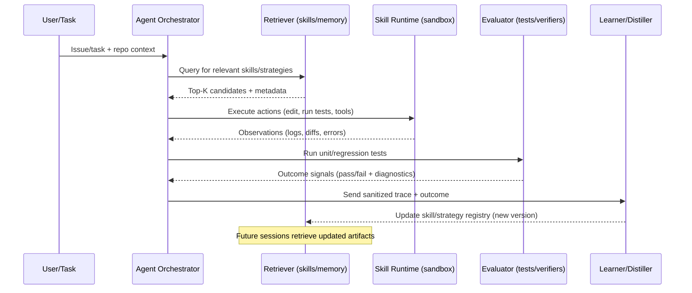

# Closing the Feedback Loop in Agentic Coding Systems

## Executive Summary

Agentic coding systems are increasingly built as “LLM-in-the-loop” control systems: the agent observes a codebase and runtime signals (tests, logs, errors), takes actions (edits, tool calls), and iterates. The core missing piece in many deployed frameworks is **closed-loop learning from real executions**—turning **what actually worked** (successful procedures) and **how the agent corrected itself** (decision rules) into reusable artifacts that reliably improve future runs without manual labeling. Recent research and industrial systems are converging on a unifying pattern: **instrument everything → distill traces into Skills/Strategies → store with governance → retrieve/inject at runtime → continuously evaluate and update**. citeturn28view0turn29view1turn21view1turn22view0turn19view0

A strong emerging “north star” is to treat **Skills** as *packaged, callable procedures* with clear applicability and termination, while treating **Strategies** as *policies over choices* (tool selection, search vs. patch, when to retrieve memory, how to react to failures). The 2026 SoK on agentic skills formalizes Skills as a 4‑tuple—applicability condition, executable policy, termination, and callable interface—which naturally supports modular reuse, composition, and governance. citeturn28view0turn28view1turn19view0

On the “distill from traces” front, systems like **Trace2Skill** demonstrate that analyzing large pools of execution trajectories and consolidating the extracted “local lessons” into a single, general skill directory can improve performance and transfer across model scales and even across domains, without parameter updates or retrieval of episodic traces at inference. Complementary work like **AgentHER** shows that “failures” can be repurposed as training signal by relabeling trajectories into achievable alternative goals, improving data efficiency and supporting multiple downstream training formats (e.g., SFT/DPO-style datasets). citeturn29view1turn29view2turn12view3

For coding agents specifically, modern frameworks (e.g., OpenHands / OpenDevin-style platforms and SWE-agent-style agent-computer interfaces) already expose the right **execution affordances**—sandboxed runtimes, event streams, file editing, and test execution. These systems can serve as “trace producers” for closed-loop learning components. The key architectural challenge is to ensure that (a) traces are captured at the right granularity and safely governed, (b) distillation methods produce stable, versioned skill/strategy artifacts, and (c) injection mechanisms are evaluated with strong benchmarks and security controls to prevent error propagation and prompt-injection-style compromise. citeturn21view1turn22view0turn16search6turn26view2turn9search3

## Definitions and Taxonomy

### Execution traces in coding agents

An **execution trace** (in this report) is the time-ordered record of an agent’s interaction with a development environment, including: (i) agent messages/plans, (ii) tool calls (terminal/Python/browser/repo navigation), (iii) environment observations (stdout/stderr, compiler errors, test failures), and (iv) artifacts (file diffs, patches, commits, PR metadata). This aligns with the design of modern agent platforms that expose an explicit action/observation loop and often an event stream architecture for recording steps. citeturn21view1turn22view0turn16search6turn8search4

### Skills versus Strategies

A practical way to separate **Skills** from **Strategies**—consistent with both the skill-systems literature and what coding agents actually need—is:

**Skills (procedures that worked)**
Reusable, callable procedures that can be invoked when an applicability condition holds, run for a bounded duration until a termination condition, and expose a stable interface for composition. The 2026 agentic-skills SoK formalizes “agentic skill” as a 4‑tuple comprising applicability, executable policy, termination, and callable interface, explicitly connecting composition to hierarchical options in RL. citeturn28view0turn28view1turn2search0

**Strategies (decision rules from corrections and repeated choices)**
Decision rules that govern *how the agent chooses and composes skills/tools* under uncertainty and feedback. Strategies typically operate at a higher control layer than Skills and include:
- **Tool-routing strategy** (which tool to call, when, and with what arguments), exemplified by tool-using agent patterns such as ReAct-style interleaving of reasoning and acting. citeturn1search0
- **Debugging strategy** (how to interpret failures, generate hypotheses, and structure retries), reflected in coding-focused self-debugging and reflection systems. citeturn10search1turn18search10
- **Experience usage strategy** (when to retrieve past knowledge and how much), studied in structured-memory coding agents that retrieve distilled commit knowledge via embeddings and reranking. citeturn20view0turn20view3
- **Search strategy** (tree search/backtracking vs. direct patching), discussed as an open issue in skill conflict resolution and failure recovery in skill-based agents. citeturn28view1

This separation matters operationally: Skills must be **portable, testable, and governable artifacts**, while Strategies must be **measurable controllers** that can be updated via self-supervision signals (tests, static checks, verifiers) without human labeling. citeturn28view0turn26view2turn21view3

### A taxonomy for closed-loop trace learning

Across recent systems, “closing the loop” can be categorized along three axes:

**What is extracted?**
- **Declarative skill guides** (high-level procedures/SoPs in text + optional scripts) as in Trace2Skill-style skill directories. citeturn29view2
- **Structured memory units** distilled from project histories (e.g., commit-derived “problem → root cause → solution” representations). citeturn20view0turn20view3
- **Training datasets** from trajectories (successes and repurposed failures) for fine-tuning or preference optimization. citeturn12view3turn16search6

**How is it injected back?**
- **Prompt-time injection** via retrieved skills/memories. citeturn17search3turn28view1turn19view0
- **Runtime modular execution** (calling code-as-skill or structured policies). citeturn16search6turn21view1
- **Parameter updates** (SFT / preference optimization / RL) using automatically labeled traces. citeturn12view3turn16search6turn1search1

**What provides the supervision signal without human labels?**
- **Execution-grounded signals** (tests, compilers, linters, environment success). citeturn21view3turn10search1turn22view0
- **Self-critique loops** that iteratively refine outputs without external labels. citeturn10search0turn18search10
- **Automated judges / AI feedback** (sometimes guided by principles) that replace human preference labels. citeturn10search2turn10search3turn8search18

## Trace Capture and Data Governance

### Trace types and “minimum sufficient” granularity

Closed-loop learning fails if traces are either too shallow (missing causal evidence) or too verbose (unretrievable, privacy-risky, and expensive). A practical “coding-session trace schema” should capture at least:

**Interaction steps (action/observation pairs)**
- Tool calls: shell commands, interpreter code, repository navigation, search/lookup actions, browser steps where relevant. Platforms like OpenHands explicitly model this via an event stream and sandboxed OS/browser/runtime; SWE-agent similarly emphasizes an agent-computer interface enabling file edits and test execution. citeturn21view1turn22view0
- Observations: stdout/stderr, exception traces, test failures, linter/type errors, dependency resolution logs. Self-debugging systems explicitly rely on execution feedback as a training signal. citeturn10search1turn21view3

**Artifacts**
- File diffs/patches, commit metadata, and “before/after” snapshots for changed files (preferably content-addressed and versioned). Systems that build long-term memory from commit histories illustrate how repository evolution encodes reusable expertise. citeturn20view0turn20view1

**Outcome labels**
- Binary success/failure (e.g., “all tests pass”), plus structured failure typing (compile error vs. logical test failure vs. timeout). “Success-only” learning discards valuable signal; trajectory relabeling systems like AgentHER explicitly target this waste. citeturn12view3turn21view3

**Granularity recommendation**
Represent traces as **nested spans** (session → subtask → tool call → artifact change), using established observability concepts so traces remain composable across frameworks. OpenTelemetry’s trace/span model and W3C Trace Context headers are widely used foundations for correlating logs, metrics, and traces across distributed components. citeturn8search4turn23search0turn8search0

### Privacy, security, and governance by design

Coding traces are unusually sensitive: they may contain proprietary code, credentials, customer data, and security-critical infrastructure details. Closing the loop without human labeling increases the risk of **silent propagation** of secrets or unsafe behaviors into skill libraries and training data.

Key risks and mitigations:

**Sensitive-data disclosure**
Logging prompts and code can leak secrets and regulated data. OWASP explicitly calls out *Sensitive Information Disclosure* and *Training Data Poisoning* as key LLM risks; both become more likely when execution traces are automatically fed back into future sessions or training corpora. citeturn26view2

**Prompt injection and “confused deputy”**
When traces include untrusted observations (e.g., web pages, READMEs, issues), injected instructions can steer the agent into misusing privileged skills/tools. OWASP highlights prompt injection and excessive agency; OpenAI recommends system-level designs that constrain impact even if manipulation succeeds. MCP also explicitly warns that its tool/data access power requires careful trust & safety controls. citeturn26view2turn9search3turn19view1

**Governance controls that scale**
- **Redaction and secret scanning** before persistence (denylist/allowlist patterns, entropy-based detectors, structured PII detectors).
- **Tiered trust and progressive disclosure** for skills: only load metadata by default; gate instruction loading and especially code execution behind trust tiers and sandbox constraints, as proposed in the skill governance literature. citeturn28view1turn21view1
- **Provenance and version control**: treat skills like software artifacts with CI-style admission tests (“verified autonomous skill generation” is explicitly identified as a key open problem). citeturn28view1turn26view1

### Instrumentation and observability tooling for trace capture

A practical stack for capturing coding-agent traces is to combine:
- **Framework-level tracing** (e.g., LangSmith-style “runs” for step-by-step traces) with
- **System-level distributed tracing** (OpenTelemetry spans with context propagation) so that tool executions, sandbox processes, and external calls are correlated. citeturn8search1turn8search4turn8search0

Open-source observability and eval tooling increasingly supports agent trajectories directly (e.g., TruLens, MLflow tracing, W&B Weave), often emphasizing OpenTelemetry compatibility for portability. citeturn8search2turn25search5turn25search8

## Automated Distillation and Self-Supervision Methods

### Core idea: convert traces into reusable, testable learning signals

“Without human labeling” does not mean “without supervision”; it means supervision comes from:
- **Executable correctness signals** (tests/linters/compilers/verifiers), citeturn21view3turn10search1
- **Self-supervision objectives** (contrastive/clustering/predictive), citeturn5search1turn4search5
- **Automated relabeling / judges** (trajectory relabeling; AI feedback), citeturn12view3turn10search2turn10search3
- **Offline policy learning** from logged trajectories. citeturn1search2turn3search1turn1search3

The practical workflow is often: **segment traces → generate candidate skill/strategy updates → validate → store/version → inject**. Trace2Skill is a concrete instantiation: it generates trajectories with an initial skill, uses parallel “success” and “error” analysts to propose patches, then consolidates patches into a conflict-free skill update. citeturn29view1turn29view2

### Method families and how they map to Skills vs Strategies

The table below summarizes major method families the field uses (or can use) to automatically distill traces into reusable Skills and Strategies for coding agents.

| Method family | What it produces | Self-supervision signal from traces | Strengths | Common failure modes | Representative primary sources |
|---|---|---|---|---|---|
| Execution-grounded outcome labeling | Success/failure tags; failure categories; patch-quality signals | Unit tests, regression tests, compilation, type checks, sandbox exit codes | Cheap, objective, directly tied to “worked” | Overfits to weak tests; reward hacking via superficial fixes | SWE-bench emphasizes real repo issues and test-based resolution; self-debugging uses execution feedback directly. citeturn21view3turn10search1 |
| Contrastive representation learning | Embeddings for trace segments, skill descriptions, failure modes | Positive pairs: similar successful segments; negatives: mismatched or failing segments | Good for retrieval and clustering; supports semantic search | Learns shortcut features; needs careful augmentation | CPC and SimCLR are canonical contrastive frameworks; useful as building blocks for trajectory embeddings. citeturn5search1turn4search0 |
| Clustering / pseudo-labeling | Trace clusters → candidate skills/strategies (“motifs”) | Clusters in embedding space; optionally constrained by outcome labels | Discovers recurring patterns without labels | Cluster instability; hard to interpret; brittle boundaries | DeepCluster is a standard pseudo-label clustering approach for representation learning. citeturn4search5 |
| Sequential pattern mining | Frequent action/observation subsequences correlated with success | Discrete event sequences (tool calls, edit→test loops) + support/confidence | Interpretable “workflow primitives”; good for Strategies | Spurious correlations; ignores semantics unless enriched | PrefixSpan is a classic sequential pattern mining algorithm. citeturn5search2 |
| Program synthesis / PBE | Executable mini-programs or transformation rules as Skills | Input-output examples derived from traced edits (before/after) | Produces deterministic, reusable code skills | DSL mismatch; brittle when context shifts | FlashFill-style synthesis shows scalable PBE for transformations. citeturn5search0turn5search11 |
| Imitation learning (behavior cloning / DAgger-style) | Policy over actions or tool calls (Strategy), possibly skill-conditioned | Demonstrations = successful trace segments (or relabeled failures) | Directly trains decision rules; simple | Distribution shift; compounding errors | DAgger formalizes mitigation of induced-distribution mismatch. citeturn4search2 |
| Offline RL / sequence-modeling RL | Learned policy/value/behavior model (Strategy) | Logged trajectories (state, action, reward derived from outcomes) | Can optimize long-horizon choices; supports credit assignment | Offline RL instability; out-of-distribution actions | Decision Transformer, CQL, and IQL are representative offline RL approaches. citeturn1search2turn3search1turn1search3 |
| Meta-learning | Rapidly adaptable strategy initializations | Many tasks/episodes; adaptation measured by few-shot improvement | Enables fast per-repo/project adaptation | Meta-overfitting; expensive and unstable | MAML is the canonical gradient-based meta-learning method. citeturn3search0 |
| Hindsight / trajectory relabeling | Additional training data from failures; alternative-goal Skills | “What you *did* achieve” relabels failed attempt | Converts failures into useful demos; improves data efficiency | Wrong relabels introduce noise; needs gating | HER is the classical idea; AgentHER adapts it to language-agent trajectories and reports improved data efficiency. citeturn2search2turn12view3 |
| Textual distillation into Skills | Declarative skill directories; step-by-step SoPs | Large-batch analysis of successes and failures | Portable, inspectable, no fine-tuning required | May be too generic; can encode wrong heuristics | Trace2Skill’s parallel analysis and consolidation produces transferable skills without retrieval at inference. citeturn29view1turn29view2 |

### Systems that explicitly operationalize trace-to-skill and trace-to-strategy learning

**Trace2Skill (2026)**
- Represents a skill as a structured directory with a root SKILL.md and auxiliary resources; evolves skills by analyzing pools of labeled successes/failures and consolidating patches. citeturn29view2turn29view1
- Reports that error-derived patches are a stable signal and that consolidated skills can transfer across models and out-of-distribution domains. citeturn29view2

**AgentHER (2026)**
- Adapts hindsight relabeling to language-agent trajectories through failure classification, outcome extraction, prompt relabeling with confidence gating, and data packaging, yielding training data usable for multiple optimization pipelines and improving data efficiency. citeturn12view3

**Commit-history distillation into structured memories (2026)**
- Distills raw commits into a structured “sextuple” capturing keywords, problem description, root-cause reasoning, and solution guidelines; then retrieves via embeddings and reranking for use in new tasks. This is directly aligned with “strategies from repeated choices/corrections” because commit histories contain repeated bug patterns and their fixes. citeturn20view0turn20view3

**Reflection and self-debug loops (2023–2024)**
- Reflexion stores natural-language reflections on feedback in an episodic memory buffer to improve subsequent trials, explicitly using feedback signals but without weight updates. citeturn18search10turn0search1
- Self-Debugging and later execution-centric debuggers show that execution feedback can be turned into self-correction behavior; this is a key ingredient for strategy induction from failures. citeturn10search1turn10search13

**Tool-use learning (2023–2024)**
- Toolformer demonstrates self-supervised training for deciding when and how to call tools. In closed-loop coding settings, the analog is to learn “call test runner now” or “search repo symbols” strategies from trace success. citeturn1search1
- CodeAct consolidates an agent’s actions into executable code, collecting multi-turn interactions for instruction tuning and highlighting a path from trace logs to training datasets. citeturn21view2turn16search6

### A concrete “trace → skill/strategy” distillation pipeline

The following diagram shows a reference workflow that generalizes across systems like OpenHands/SWE-agent (trace producers), Trace2Skill (skill distillation), and AgentHER (failure repurposing), with explicit governance gates.

```mermaid
flowchart LR
  A[Agent runtime in sandbox\n(code edits, tool calls, tests)] --> B[Trace capture\n(events, artifacts, outcomes)]
  B --> C[Sanitize & segment\nsecrets/PII redaction\nsubtask boundaries]
  C --> D1[Skill distiller\nsummarize SOPs\nsynthesize scripts]
  C --> D2[Strategy distiller\nmine decision rules\nlearn routing policies]
  C --> D3[Trajectory relabeler\nsalvage failures\ncreate new demos]
  D1 --> E[Skill/Strategy registry\nversioned + signed]
  D2 --> E
  D3 --> F[Training set builder\nSFT/DPO/RL datasets]
  E --> G[Admission tests\nunit tests, sandbox checks\nsafety scans]
  F --> H[Optional model update\nSFT/DPO/offline RL]
  G --> I[Retrieval & injection\nprompt + runtime modules]
  H --> I
  I --> A
```

## Skill and Strategy Representation, Storage, and Retrieval

### Skill formats in real systems

A recurring finding across deployed “skill ecosystems” is that skills must be **discoverable with minimal context** and **loadable on demand**. This motivates formats like:

**Metadata + instruction document (SKILL.md)**
- Anthropic’s public skills repository describes skills as folders of instructions, scripts, and resources loaded dynamically, with a SKILL.md containing YAML frontmatter (name, description) plus instructions/guidelines. citeturn19view0
- Trace2Skill similarly models a skill as a human-readable directory with root SKILL.md plus auxiliary resources (scripts/references). citeturn29view2
- The agentic-skills SoK describes “metadata-driven disclosure” as a common design pattern to cope with limited context windows and enable safe discovery. citeturn28view1

**Code-as-skill (executable scripts)**
- In coding agents, the most robust “skills” are often executable: repo navigation helpers, test runners, patch application scripts, deterministic transformations. This aligns with the CodeAct paradigm of using executable code actions as a unifying action space. citeturn16search6turn21view2

**Structured memory as “proto-skills”**
- Commit-distilled structured memories (keywords/problem/root cause/solution guidelines) are effectively skill fragments that can be composed into strategies (“when you see symptom X, consider root cause Y, apply fix pattern Z”). citeturn20view0turn20view3

### Strategy representations

Strategies are best treated as **control artifacts** rather than “documents,” though documents can encode them. Common representations include:

**Prompted decision policies**
- ReAct-style prompting is an explicit strategy template: interleave reasoning traces with tool actions to reduce hallucination and support exception handling. citeturn1search0

**Routing policies over skills**
- The skill SoK identifies two dominant runtime routing strategies: embedding-based retrieval and LLM-mediated routing, with hybrids that narrow candidates by embeddings and select by LLM reasoning. citeturn28view1

**Learned policies from offline traces**
- Offline RL or sequence modeling (Decision Transformer) can represent strategies as learned policies over action tokens conditioned on desired outcomes, directly trained from logged traces. citeturn1search2turn2search3

### Storage, indexing, and retrieval

Closed-loop systems require storage layers that support:
- **Exact replay** (for debugging and evaluation),
- **Semantic retrieval** (for injection),
- **Versioning** (for governance and rollback).

Key building blocks:

**Vector indexing and ANN retrieval**
- Many systems embed memories/skills and perform approximate nearest neighbor (ANN) search, often followed by reranking. The structured-memory system explicitly uses a two-stage retrieval-then-rerank pipeline and cites FAISS as an ANN backend. citeturn20view0turn17search8
- FAISS design principles and HNSW-style indexes are canonical ANN choices when scaling skill repositories and trace embeddings. citeturn17search8turn17search2

**Retrieval-Augmented Generation (RAG) as a general injection primitive**
- RAG provides a general recipe combining parametric and non-parametric memory; in agent systems, the “non-parametric memory” is often a skill/memory store. citeturn17search3

**Long-term memory management**
- Memory-tiered systems like MemGPT model the need to page relevant information into limited context windows, a direct analogue to “skill disclosure” schemes. citeturn11search1turn28view1

### Trade-offs among representation choices

| Representation | Natural fit (Skill vs Strategy) | Pros | Cons | Best injection method |
|---|---|---|---|---|
| SKILL.md + auxiliary scripts (directory) | Skill (primary), Strategy (encoded as SOPs) | Human-auditable; portable; versionable; works without fine-tuning | Can become verbose; may be underspecified | Metadata retrieval → load full instructions → execute scripts in sandbox citeturn19view0turn29view2turn28view1 |
| Executable “code skills” / macros | Skill | Deterministic; testable; compresses complex behavior | Requires sandbox and dependency control | Runtime module invocation; CodeAct-style code execution citeturn21view2turn21view1 |
| Structured memory units (problem/root-cause/fix) | Strategy (primary) | Captures “why” and “how”; good for retrieval-guided debugging | Quality depends on distillation; may encode incorrect causality | Embed + retrieve + rerank; inject as context for planning/debugging citeturn20view0turn17search8 |
| Learned routing policy (prompted or trained) | Strategy | Can optimize tool/skill selection; supports long-horizon behavior | Harder to audit; may be brittle under shift | Fine-tuning / offline RL / constrained policy execution citeturn1search2turn3search1turn28view1 |
| Preference-labeled trace datasets (SFT/DPO-ready) | Strategy and Skill-style behaviors | Scales with data; reusable across models | Data poisoning risk; requires strong filtering | Model updates (SFT/DPO/RL) with automated labeling citeturn12view3turn10search2 |

## Integration and Injection Mechanisms

### Injection mechanisms in practice

A closed-loop system must decide *where* learning lives. The main mechanisms are:

#### Prompt-time injection and runtime retrieval

This is the most common “low-friction” approach:
1. Retrieve relevant skills/memories (embedding search + rerank). citeturn28view1turn20view0
2. Inject into the agent’s working context, often via progressive disclosure (metadata first, then full skill). citeturn28view1turn19view0
3. Let the agent decide whether to execute the skill or use it as guidance.

This approach is emphasized in skill-system patterns and is compatible with both open and closed models since it avoids fine-tuning. citeturn28view1turn29view2

#### Runtime patching and modular skill libraries

Here, the agent runtime is explicitly extended with callable skill modules:
- OpenHands-style platforms already expose an execution runtime (docker sandbox, bash, IPython, browser) suitable for running code-as-skill safely. citeturn21view1
- CodeAct frames actions as executable code, enabling an agent to revise actions based on new observations and supporting modular behaviors. citeturn21view2

This is the natural home for “Skills” as executable procedures and for high-assurance tools (e.g., applying patches, running tests).

#### Parameter update: fine-tuning, preference optimization, and offline RL

When trace volume is high and tasks are repeated, weight updates can outperform pure retrieval—if governance is strong.

Key no-human-label pathways:
- **Self-supervised tool-use training** (Toolformer) shows how API-calling behavior can be trained with minimal demonstrations, leveraging self-supervised filtering to decide when calls are useful. citeturn1search1
- **Instruction tuning from interaction datasets** (CodeActInstruct) uses logged multi-turn code-action interactions to improve agent-oriented tasks. citeturn21view2
- **Failure repurposing into training corpora** (AgentHER) converts failures into additional high-quality SFT/DPO-style data, improving data efficiency. citeturn12view3
- **AI feedback instead of human preference labels** is operationalized in Constitutional AI and scaled in RLAIF-style work, relevant when correctness is hard to verify purely via tests. citeturn10search2turn10search3

### Standardized tool and capability interfaces

Tool/skill injection becomes easier when tools have stable, composable interfaces. MCP provides a standardized JSON-RPC-based protocol for exposing tools, prompts, and resources to LLM applications, explicitly acknowledging security and trust considerations due to arbitrary data access and code execution. citeturn19view1turn19view2

### Recommended architectures

A practical recommendation—supported by the trade-offs observed across skill-system designs—is to adopt a **three-layer architecture**:

1. **Skill layer (auditable procedures)**: versioned SKILL.md + scripts, tested in sandbox before admission. citeturn19view0turn28view1turn21view1
2. **Strategy layer (routing + failure recovery)**: learned or prompted policies controlling retrieval, tool selection, and retry logic, with explicit guardrails and monitoring. citeturn28view1turn26view2turn9search3
3. **Optional model improvement layer**: accumulate verified trace-derived data (including relabeled failures) for periodic SFT/DPO/offline RL updates when ROI justifies. citeturn12view3turn1search2turn3search1

A component-interaction view:



## Evaluation, Benchmarks, and Safety

### What to measure

To claim a feedback loop is “closed,” evaluation must measure not only end-task success but also whether **learning from traces improves future performance** under realistic constraints.

Key metric groups:

**Capability and sample efficiency**
- Improvement in success rate / resolved rate vs. baseline after N traces. AgentHER explicitly reports improvements over success-only SFT and claims improved data efficiency (matching baseline with fewer successful demos). citeturn12view3
- For coding tasks, success is often “tests pass” or “issue resolved,” as formalized in benchmarks like SWE-bench (real GitHub issues with tests). citeturn21view3

**Transfer**
- Cross-repo transfer (learned skills/strategies from one repository help another).
- Cross-model transfer (skills distilled with one model help another), explicitly highlighted by Trace2Skill’s cross-model gains. citeturn29view1turn29view2

**Robustness**
- Performance under perturbations (different error messages, dependency versions, flaky tests).
- Stability of tool benchmarks: StableToolBench is motivated by the instability of real APIs and proposes a virtual API server + stable evaluation system. citeturn24search0

**Safety and security**
- Rate of unsafe actions, secret exfiltration attempts, or privilege escalation.
- Resilience to prompt injection and excessive agency. OWASP explicitly lists prompt injection and excessive agency as major risks, and OpenAI emphasizes designing agents so the impact of manipulation is constrained. citeturn26view2turn9search3
- Skill-layer threats: poisoned skill retrieval, malicious payloads, cross-tenant leakage, and drift exploitation are explicitly systematized in the skill governance literature. citeturn28view1

### Benchmarks commonly used or well-suited for closed-loop evaluation

| Benchmark | What it tests | Why it matters for trace-to-skill/strategy learning | Primary source |
|---|---|---|---|
| SWE-bench | Real GitHub issue resolution with tests | Direct, execution-grounded success signal; supports iterative patch/test loops | citeturn21view3 |
| SWE-bench Verified | Human-validated subset for reliability | Reduces noisy/unresolvable cases; stronger signal for comparing learning loops | citeturn0search11turn0search3 |
| HumanEval | Function-level code generation with unit tests | Fast iteration; good for measuring debug strategies and pass@k | citeturn6search0 |
| MBPP | Entry-level Python synthesis tasks | Useful for broad code synthesis evaluation; complements HumanEval | citeturn6search13turn6search5 |
| TheAgentCompany | Consequential “digital worker” tasks incl. coding | Measures long-horizon, multi-tool workflows; closer to real work settings | citeturn16search1 |
| AgentBench | Multi-environment LLM-as-agent benchmarking | Captures interactive agent behavior, not just final outputs | citeturn6search3 |
| WebArena | Realistic web environment (incl. collaborative dev domain) | Stress-tests robustness and long-horizon tool use; highlights large gaps | citeturn23search1 |
| API-Bank | Tool-augmented dialogs with runnable eval | Measures planning/calling APIs; useful for strategy learning | citeturn23search3 |
| ToolBench / StableToolBench | Large-scale tool learning; stability focus | Important for general tool-use strategies; stable evaluation improves comparability | citeturn24search1turn24search0 |
| D4RL | Offline RL datasets | Relevant when training strategies via offline RL from logs | citeturn2search3 |

The skill SoK also argues that no single benchmark covers all skill dimensions; comprehensive evaluation requires combining benchmarks and measuring robustness and governance properties. citeturn28view1

### Safety, robustness, and ethical concerns in feedback-loop closure

**Error propagation and “baking in” hallucinations**
If a trace-derived skill encodes a mistaken fix pattern, repeated retrieval/injection can amplify the error across sessions. ReAct explicitly targets hallucination and error propagation by grounding actions in external observations, but closed-loop learning can reintroduce propagation if governance is weak. citeturn1search0turn28view1

**Training data poisoning and supply-chain analogs**
Automatically ingesting traces into training data resembles a software supply chain: poisoned traces can taint future models/skills. OWASP explicitly lists training data poisoning and supply chain vulnerabilities as top risks. citeturn26view2

**Privacy and secret leakage**
Storing raw code and logs can violate confidentiality. A “living document” approach to AI risk management emphasizes ongoing review and updates; NIST’s AI RMF frames risk management as an organizational process rather than a one-time checklist, and explicitly describes the framework as subject to ongoing review/updates. citeturn27view1turn26view0

**Over-automation and excessive agency**
Closed-loop improvements can increase autonomy, raising the risk of unintended side effects. OWASP identifies excessive agency/overreliance risks; skill governance work recommends trust tiers and sandboxing to bound actions. citeturn26view2turn28view1turn21view1

## Tooling Landscape, Reference Architectures, and Research Gaps

### Agent frameworks and “trace producers” for coding sessions

Several frameworks already provide the environmental interfaces required for reliable execution traces:

- **OpenHands / OpenDevin-style platforms** provide a docker-sandboxed environment, event streams, and integrated evaluation harnesses across multiple benchmarks—an ideal substrate for trace capture and replay. citeturn21view1turn16search0
- **SWE-agent** emphasizes specialized agent-computer interfaces that improve an agent’s ability to edit files, navigate repos, and run tests, with benchmark results reported on SWE-bench and HumanEvalFix. citeturn22view0
- **CodeAct** proposes executable code actions as a unifying action space and collects multi-turn interaction data for instruction tuning, making traces naturally structured for learning. citeturn21view2turn16search6
- **CodeAgent** integrates multiple programming tools and explicitly studies multiple “agent strategies” (e.g., ReAct-like and rule-based variants), giving concrete strategy taxonomies for repo-level tasks. citeturn18search5turn15view1

### Skill/strategy ecosystems and standards

- Anthropic’s public skill repository defines a concrete skills packaging format (SKILL.md with YAML frontmatter plus instructions/resources) and illustrates progressive skill loading in practice. citeturn19view0turn28view1
- MCP standardizes how hosts/clients/servers expose tools, prompts, and resources, including capability negotiation and explicit security considerations. citeturn19view1turn19view2

(Organizations referenced: entity["company","Anthropic","ai safety company"], entity["company","OpenAI","ai research company"], entity["company","Microsoft","software company"], entity["company","Meta","technology company"], entity["organization","NIST","us standards agency"], entity["organization","OWASP","security nonprofit"], entity["company","GitHub","code hosting platform"], entity["company","LangChain","llm tooling company"], entity["organization","OpenTelemetry","observability project"])

### Trace storage, observability, and evaluation toolchains

A modern closed-loop system typically combines:
- **Distributed tracing standards** (OpenTelemetry + W3C trace context) to correlate multi-step workflows across processes and tools. citeturn8search4turn23search0turn8search0
- **LLM/agent observability platforms** (LangSmith-style tracing; Helicone-style gateways; Weave/MLflow tracing) that expose step-wise runs and metadata like cost/latency. citeturn8search1turn8search5turn8search15turn25search8turn25search5
- **Agent evaluation frameworks** with trajectory-level evaluators (OpenAI agent eval tooling; LangChain agentevals; OpenAI Evals). citeturn25search2turn25search3turn13search0

### Research gaps and future directions

**Robust skill boundary discovery and segmentation**
Extracting stable skills requires segmenting traces into meaningful sub-procedures (e.g., “reproduce bug,” “localize fault,” “patch,” “validate”). Sequence mining helps but often ignores semantics; richer segmentation remains an open bottleneck. citeturn5search2turn28view1

**Verification-at-admission for autonomous skill evolution**
The skill SoK highlights a central tension: scalable autonomous generation vs. reliability, recommending CI-like verification before skills become reusable. This is particularly acute in coding, where a single unsafe skill can cause irreversible repo damage or secret leakage. citeturn28view1turn21view1turn26view2

**Preventing negative transfer and “strategy overfitting”**
Trace2Skill argues that broad, parallel trajectory analysis can yield transferable patterns; however, for codebases, repository conventions are idiosyncratic. Designing strategies that generalize (e.g., “write a minimal repro test”) while still respecting repo-specific norms is an open design space where structured-memory approaches are promising but not yet definitive. citeturn29view1turn20view0turn20view3

**Stable, reproducible evaluation for agentic workflows**
Tool-use and web benchmarks have faced instability (changing APIs, nondeterminism). StableToolBench explicitly targets this, but analogous stabilization for coding environments (dependency drift, flaky tests) remains a practical challenge for measuring “learning over time.” citeturn24search0turn21view3turn0search11

**Security models for skill repositories**
The skill SoK frames threats such as poisoned retrieval, malicious payloads, cross-tenant leakage, and confused-deputy attacks, recommending trust tiers and sandbox granularity decisions. Translating these into standard enterprise-grade controls (signing, provenance, policy-as-code) is still emerging. citeturn28view1turn9search3turn19view1

**Unifying prompt-time and weight-update learning**
The field currently splits between (a) portable declarative skill distillation without parameter updates and (b) training from traces (SFT/DPO/offline RL). AgentHER and CodeAct illustrate how to package traces for model updates, while Trace2Skill shows strong portability without training. A major research frontier is hybrid systems that decide *when* a pattern should become (i) a prompt-time skill, (ii) a runtime module, or (iii) a weight update—based on measurable stability, safety, and transfer. citeturn12view3turn21view2turn29view1turn28view1
