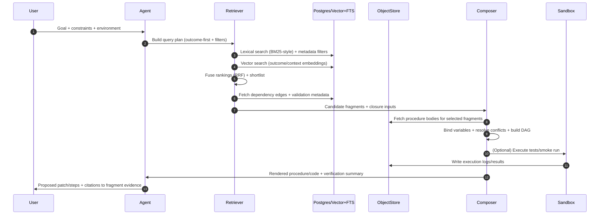

# Fragment-Oriented Validated Knowledge for AI Coding Agents

## Executive summary

Decomposing “validated knowledge” into **procedure**, **context**, and **outcome** is a practical way to turn monolithic “skill files” into **small, independently retrievable fragments** that can be fetched and recomposed on demand. The core idea is to store each fragment with (a) an executable or compilable **procedure**, (b) explicit **context** describing applicability and constraints, and (c) verifiable **outcomes** (postconditions, artifacts, tests, and side effects). This separation supports more precise retrieval than loading entire skills at session start, aligns naturally with formal planning models that use **preconditions and effects**, and makes governance possible because each fragment can be validated, versioned, and provenance-traced as a standalone unit. citeturn1search2turn1search3turn4search1turn0search0

A robust implementation typically becomes a **hybrid retrieval + constrained recomposition** pipeline:

1. **Index fragments by dimension**: maintain separate semantic embeddings for procedure/context/outcome, plus symbolic indices for filters (language/runtime/APIs/security level) and dependency edges in a graph or relational adjacency table. Hybrid search (keyword + semantic + metadata filters) tends to outperform single-mode retrieval in realistic engineering datasets. citeturn0search0turn2search0turn3search0turn3search2turn3search6turn9search1
2. **Retrieve with constraints**: use metadata filtering and lexical matching to enforce hard constraints, then use vector similarity on the relevant dimension (often outcome-first) to shortlist fragments; fuse results using rank-fusion techniques such as **Reciprocal Rank Fusion (RRF)**. citeturn3search0turn3search2turn10search0
3. **Recompose with correctness hooks**: treat fragments as “operators” with pre/postconditions (similar to PDDL-style action schemas) and compose them via HTN-style decomposition or operator planning; assemble code with explicit variable binding, dependency closure, and conflict resolution policies. citeturn1search2turn1search3
4. **Keep fragments “validated knowledge”**: attach test evidence and environment fingerprints; encode provenance with W3C PROV; sign and attest artifacts (SLSA / in-toto / Sigstore); version with SemVer; and revalidate continuously as dependencies evolve. citeturn4search1turn0search2turn7search1turn4search10turn4search3turn5search0turn4search0
5. **Optimize for latency and context windows**: implement multi-stage retrieval, caching, hierarchical chunking, and dependency-aware “minimal context packaging,” so the agent pulls only what it needs for the current intent. citeturn10search1turn0search1

## Three-dimension decomposition model

### Procedure

**Definition.** *Procedure* is the “how”: a fragment’s executable or quasi-executable representation, such as a function template, a patch recipe, a command sequence, a build/test pipeline step, or a planner operator. In a coding-agent setting, procedure should be **parameterized** (explicit inputs/outputs), **dependency-addressable** (explicit imports, toolchain requirements), and ideally **executable in isolation** inside a sandbox.

**Rationale.** Storing procedure separately prevents “tool instructions and code” from being inseparably entangled with situational requirements. It supports (a) fast retrieval of minimal code needed to act and (b) recomposition through dependency closure (only import or call the needed procedures). This aligns with formal planning representations where actions have explicit structure and can be sequenced. citeturn1search2turn1search3

**Practical guidance.**
- Prefer **idempotent, atomic steps** that can be composed into DAGs.
- Expose parameters/slots rather than hard-coded values.
- Represent side effects explicitly (filesystem, network, external services).

### Context

**Definition.** *Context* is the “when/where it applies”: prerequisites, constraints, assumptions, and non-functional requirements. Typical context fields for code fragments include:
- Runtime: language + version, OS/arch, interpreter flags
- Dependencies: libraries, tools, CLI availability, API versions
- Security posture: allowed network access, secrets handling, sandbox requirements
- Input constraints: shape/type expectations, encoding, size limits
- Operational constraints: latency budgets, memory budgets, offline vs online

**Rationale.** Context is what prevents the agent from composing “correct-looking” code that is wrong for the environment. Explicit context enables **symbolic filtering** (hard constraints) before semantic retrieval, and it becomes the primary surface for conflict resolution when fragments clash (e.g., incompatible dependency versions). citeturn6search0turn1search0

**Validation hook.** Context is also where you pin “validated” meaning: the fragment was tested under a specified environment fingerprint, and deviations can trigger revalidation.

### Outcome

**Definition.** *Outcome* is the “what it achieves”: verifiable postconditions and produced artifacts. Outcomes should be written as **machine-checkable claims** whenever possible:
- Artifacts created/modified (files, functions, modules, APIs)
- Postconditions on state (e.g., “table exists,” “endpoint returns 200,” “tests pass”)
- Performance bounds (best-effort: “O(n log n)”, or empirical: “p95 < 200ms under X”)
- Safety properties (no network, no filesystem writes, no shell execution)
- Test or verification suite references and expected results

**Rationale.** Outcome-first is often the best retrieval strategy for coding agents because user intent is usually expressed as a goal, not as a method (“make this faster,” “parse this format,” “add rate-limiting”). Outcome indexing supports goal-directed planning and HTN decomposition: select fragments whose effects satisfy unmet goals. citeturn1search2turn1search3turn0search0

## Fragment schemas and indexing

### Core fragment object model

A minimal but practical model is:

- **Fragment**: the top-level unit, with stable ID/version.
- **Dimension payloads**: `procedure`, `context`, `outcome` stored as separate “subdocuments” (or separate rows) to allow independent embeddings and independent retrieval.
- **Edges**: `depends_on`, `requires`, `conflicts_with`, `supersedes`.
- **Validation evidence**: tests, checksums, attestations.
- **Provenance**: who/what produced and validated the fragment.

This aligns well with provenance models that describe entities, activities, and agents (e.g., W3C PROV). citeturn4search1turn0search2

### Concrete JSON schema for fragment separation

Below is a JSON Schema-style structure emphasizing separation of the three dimensions and indexable metadata. (The JSON Schema ecosystem explicitly supports structural validation vocabularies for JSON instances.) citeturn6search1turn6search0

```json
{
  "$schema": "https://json-schema.org/draft/2020-12/schema",
  "$id": "https://example.org/schemas/agent-fragment.schema.json",
  "title": "Agent Knowledge Fragment",
  "type": "object",
  "required": ["fragment_id", "version", "dimensions", "dependencies", "validation", "provenance"],
  "properties": {
    "fragment_id": { "type": "string", "pattern": "^[a-z0-9][a-z0-9._/-]{2,128}$" },
    "version": { "type": "string" },
    "status": { "type": "string", "enum": ["draft", "validated", "deprecated", "revoked"] },

    "index_keys": {
      "type": "object",
      "properties": {
        "language": { "type": "string" },
        "runtime": { "type": "string" },
        "os": { "type": "string" },
        "tags": { "type": "array", "items": { "type": "string" } },
        "apis": { "type": "array", "items": { "type": "string" } },
        "capabilities": { "type": "array", "items": { "type": "string" } },
        "risk_tier": { "type": "string", "enum": ["low", "medium", "high"] }
      },
      "additionalProperties": true
    },

    "dimensions": {
      "type": "object",
      "required": ["procedure", "context", "outcome"],
      "properties": {
        "procedure": {
          "type": "object",
          "required": ["kind", "body", "inputs", "outputs"],
          "properties": {
            "kind": { "type": "string", "enum": ["python", "patch", "shell", "dsl"] },
            "body": { "type": "string" },
            "inputs": { "type": "array", "items": { "$ref": "#/$defs/slot" } },
            "outputs": { "type": "array", "items": { "$ref": "#/$defs/slot" } },
            "side_effects": { "type": "array", "items": { "type": "string" } }
          }
        },
        "context": {
          "type": "object",
          "required": ["assumptions", "constraints"],
          "properties": {
            "assumptions": { "type": "array", "items": { "type": "string" } },
            "constraints": {
              "type": "object",
              "properties": {
                "requires_network": { "type": "boolean" },
                "writes_files": { "type": "boolean" },
                "python": { "type": "string" },
                "dependencies": {
                  "type": "array",
                  "items": { "$ref": "#/$defs/dependency" }
                }
              },
              "additionalProperties": true
            }
          }
        },
        "outcome": {
          "type": "object",
          "required": ["claims", "tests"],
          "properties": {
            "claims": { "type": "array", "items": { "type": "string" } },
            "postconditions": { "type": "array", "items": { "type": "string" } },
            "artifacts": { "type": "array", "items": { "$ref": "#/$defs/artifact" } },
            "tests": { "type": "array", "items": { "$ref": "#/$defs/test_ref" } }
          }
        },

        "embeddings": {
          "type": "object",
          "properties": {
            "procedure": { "$ref": "#/$defs/embedding_ref" },
            "context": { "$ref": "#/$defs/embedding_ref" },
            "outcome": { "$ref": "#/$defs/embedding_ref" }
          }
        }
      }
    },

    "dependencies": {
      "type": "object",
      "properties": {
        "depends_on": { "type": "array", "items": { "type": "string" } },
        "conflicts_with": { "type": "array", "items": { "type": "string" } },
        "supersedes": { "type": "array", "items": { "type": "string" } }
      },
      "additionalProperties": false
    },

    "validation": {
      "type": "object",
      "required": ["validation_level", "evidence"],
      "properties": {
        "validation_level": { "type": "string", "enum": ["unit", "integration", "e2e", "formal", "static-only"] },
        "evidence": {
          "type": "array",
          "items": {
            "type": "object",
            "required": ["type", "ref", "digest"],
            "properties": {
              "type": { "type": "string", "enum": ["test_report", "lint_report", "sast_report", "benchmark", "attestation"] },
              "ref": { "type": "string" },
              "digest": { "type": "string" },
              "created_at": { "type": "string", "format": "date-time" }
            }
          }
        }
      }
    },

    "provenance": {
      "type": "object",
      "required": ["prov_bundle_ref"],
      "properties": {
        "prov_bundle_ref": { "type": "string" },
        "content_digest": { "type": "string" }
      }
    }
  },

  "$defs": {
    "slot": {
      "type": "object",
      "required": ["name", "type"],
      "properties": {
        "name": { "type": "string" },
        "type": { "type": "string" },
        "required": { "type": "boolean", "default": true },
        "default": {}
      }
    },
    "dependency": {
      "type": "object",
      "required": ["name", "specifier"],
      "properties": {
        "name": { "type": "string" },
        "specifier": { "type": "string" },
        "source": { "type": "string" }
      }
    },
    "artifact": {
      "type": "object",
      "required": ["kind", "path_or_name"],
      "properties": {
        "kind": { "type": "string", "enum": ["file", "module", "function", "api", "container-image"] },
        "path_or_name": { "type": "string" }
      }
    },
    "test_ref": {
      "type": "object",
      "required": ["kind", "selector"],
      "properties": {
        "kind": { "type": "string", "enum": ["pytest", "unittest", "shell", "workflow"] },
        "selector": { "type": "string" }
      }
    },
    "embedding_ref": {
      "type": "object",
      "required": ["model", "vector_ref"],
      "properties": {
        "model": { "type": "string" },
        "vector_ref": { "type": "string" },
        "dim": { "type": "integer" }
      }
    }
  }
}
```

This schema builds on JSON Schema draft 2020-12 concepts (structural validation vocabularies and dialects). citeturn6search0turn6search1

### JSON-LD and provenance-friendly encoding

If you want fragments to interoperate with knowledge graphs and provenance systems, JSON-LD can provide a Linked Data serialization while still “looking like JSON.” citeturn0search3turn7search0

Below is an illustrative JSON-LD fragment that:
- Treats the fragment as an **Entity**,
- Treats validation as a **PROV Activity** with timestamps and a tool “Agent,”
- Links to separate documents for the three dimension payloads.

(Using PROV in JSON has established serializations (e.g., PROV-JSON), and PROV can be expressed as an ontology (PROV-O).) citeturn4search1turn0search2turn7search1

```json
{
  "@context": {
    "prov": "http://www.w3.org/ns/prov#",
    "ex": "https://example.org/vocab#",
    "schema": "https://schema.org/"
  },
  "@id": "ex:fragment/py/parse-csv/1.3.0",
  "@type": "prov:Entity",
  "schema:name": "Parse CSV with dialect detection",
  "ex:status": "validated",

  "ex:procedureRef": "ex:fragment-body/py/parse-csv/1.3.0/procedure",
  "ex:contextRef": "ex:fragment-body/py/parse-csv/1.3.0/context",
  "ex:outcomeRef": "ex:fragment-body/py/parse-csv/1.3.0/outcome",

  "prov:wasGeneratedBy": {
    "@id": "ex:validation-run/2026-03-18T22:10:11Z",
    "@type": "prov:Activity",
    "prov:startedAtTime": "2026-03-18T22:10:11Z",
    "prov:endedAtTime": "2026-03-18T22:12:05Z",
    "prov:wasAssociatedWith": {
      "@id": "ex:agent/ci-runner/github-actions",
      "@type": "prov:Agent",
      "schema:name": "CI Runner"
    },
    "prov:used": [
      "ex:tool/pytest",
      "ex:tool/linter"
    ]
  },

  "prov:wasDerivedFrom": [
    "ex:source-repo/git/commit/9f2c...d1"
  ]
}
```

### Indexing strategy: separate embeddings, separate symbolic keys

A high-leverage practice is to embed and index **each dimension separately**, because user queries often refer primarily to one axis:

- “How do I do X?” → procedure-heavy
- “In Python 3.12 on Windows…” → context-heavy constraints
- “I need a function that outputs Y…” → outcome-heavy

This maps well to retrieval-augmented generation (RAG) systems that combine parametric knowledge with explicit “non-parametric memory” accessed via retrieval. citeturn0search0

A practical indexing layout:

- **Vector indexes**:
  - `procedure_embedding`: retrieval when the agent needs method/implementation detail.
  - `outcome_embedding`: retrieval when the agent needs goal satisfaction.
  - `context_embedding`: retrieval when the agent needs environment-specific constraints or guardrails.
- **Lexical (inverted) index** for identifiers/APIs/error strings (BM25-style scoring is a standard baseline; many search libraries implement BM25 variants). citeturn2search0turn2search13
- **Metadata filters** (language, runtime, safety tier) applied before/alongside vector search; many vector-store integrations expose a `filter` parameter for this reason. citeturn10search0
- **Dependency graph** edges stored either in:
  - a graph DB, or
  - relational adjacency tables with recursive queries / application-side expansion.

## Retrieval strategies and query patterns

### Retrieval methods and when they fit

The table below summarizes the main retrieval families used in modern RAG and agent systems, with emphasis on fragment-level retrieval.

| Retrieval family | Core mechanism | Strengths | Failure modes | Best used for |
|---|---|---|---|---|
| Sparse lexical (BM25/BM25F) | Inverted index scoring | Exact token match; great for API names, error strings; efficient | Misses paraphrases; brittle with synonyms | Code symbol lookup, stack traces, config keys citeturn2search0turn2search13 |
| Dense semantic | Vector similarity / ANN | Paraphrase & intent match; good for natural language goals | Can miss exact identifiers; can retrieve “close but wrong” | Outcome-first retrieval, conceptual tasks citeturn0search0turn0search1 |
| Late interaction (e.g., ColBERT) | Token-level embeddings + late scoring | Better precision than single-vector dense; can preserve term matching | Heavier storage/compute; more complex infra | High-precision retrieval on medium corpora citeturn2search3turn2search7 |
| Learned sparse (e.g., SPLADE) | Sparse expansions suitable for inverted indexes | Combines interpretability + expansion; can generalize better out-of-domain than dense in some regimes | Training complexity; model drift | Domain-specific technical corpora; identifiers + semantics citeturn3search1turn3search5 |
| Hybrid (fusion of lexical + semantic) | Parallel retrieval + fusion (RRF or weighted sum) | Stronger recall and precision; robust across query types | Requires tuning/engineering; score calibration if not rank-fusion | Production agent retrieval across mixed queries citeturn3search0turn3search2turn3search6turn9search1 |
| Symbolic / graph | Traversal and pattern queries | Exact control; handles dependencies explicitly | Requires good metadata; brittle if schema poor | Dependency closure, compatibility checks citeturn8search2 |

### Hybrid retrieval patterns that work well for fragments

**Outcome-first hybrid retrieval** is a strong default:

1. Run lexical retrieval over:
   - outcome claims,
   - artifact names,
   - API identifiers,
   - common error strings.
2. Run dense retrieval over **outcome embeddings** (and sometimes context embeddings).
3. Fuse with **RRF**, which avoids direct score normalization and instead aggregates by rank. citeturn3search0turn3search2turn3search4

RRF is widely implemented in search products and documented as a recommended hybrid approach in some ecosystems. citeturn3search6turn3search2

### Concrete query patterns

#### Pattern: partial match + constraints (outcome dimension)

**Intent.** “Find a fragment that produces a CSV parser function, but only for Python 3.11+ and no network access.”

**Query plan.**
- Hard filters: language=python; context.requires_network=false; python>=3.11
- Soft ranking: vector similarity on outcome embedding, plus lexical match on “csv”, “dialect”, “sniffer”.

This “filter-then-score” pattern is explicitly exposed by many vector-store frameworks via a metadata `filter` parameter. citeturn10search0

#### Pattern: dependency-aware retrieval (symbolic expansion step)

1. Retrieve top-K candidate fragments by outcome.
2. Expand each candidate’s dependency closure: `depends_on` + `requires`.
3. Remove candidates whose closure violates constraints (e.g., disallowed licenses, forbidden network).
4. Rerank candidates by:
   - number of required fragments,
   - validation freshness,
   - conflict penalties,
   - semantic match.

Graph pattern matching (in graph databases) is a natural fit for closure queries (“give me all transitive dependencies”). Graph query languages such as Cypher expose pattern-based retrieval idioms (e.g., `MATCH` patterns). citeturn8search2turn8search6

#### Pattern: schema-aware retrieval for “context-heavy” requests

**Intent.** “In an air-gapped environment…” or “must run in AWS Lambda…” or “no filesystem writes.”

In these cases, retrieve **context fragments** first (guardrails, environment adapters), then retrieve procedures compatible with that context.

This improves reliability because it forces constraint extraction and compatibility checks earlier, reducing wasted token budget on incompatible procedures.

### Storage-backed retrieval implementations

A common production pattern is “one system, two indexes”:
- full-text index for lexical retrieval
- vector index for semantic retrieval
- both sharing the same primary keys and metadata filters

For example, relational databases can support full-text search with GIN/GiST indexes and store vectors via extensions; PostgreSQL documents GIN/GiST as preferred index types for text search when searching regularly. citeturn8search1turn8search5

Vector search implementations often use ANN graph indexes such as HNSW to reduce latency at scale. The HNSW algorithm is a widely cited approach for efficient approximate nearest neighbor search. citeturn0search1turn0search5

## Recomposition into executable procedures

### Treat fragments as planning operators

A practical recomposition mental model is:

- **Context → Preconditions**
- **Outcome → Effects / Goals satisfied**
- **Procedure → Operator implementation**

This matches classic planning formalisms where actions have preconditions and effects and planners search for sequences that reach a goal. PDDL is a commonly referenced planning-domain language that explicitly captures action specifications for planners. citeturn1search2

For agent coding, you usually want **two layers**:

- **HTN layer** for macro decomposition (“implement REST client” → “auth” + “pagination” + “retry” + “typing”); HTN planning systems like SHOP2 formalize hierarchical decomposition. citeturn1search3turn1search7
- **Operator layer** for concrete steps (templates, patches, commands), which the agent can execute or render as code.

### Dependency closure and assembly as a DAG

Recomposition typically becomes a DAG assembly problem:

- Nodes: fragments (procedure bodies)
- Edges: `depends_on` and data-flow (output slot → input slot)
- Constraints: context compatibility, safety policy, version bounds

Once the DAG is built, generate code via:
- alphabetical / stable topological ordering (deterministic builds),
- explicit import aggregation,
- adapter insertion (type conversions) if needed.

### Variable binding and slot unification

A robust technique is to define all procedures with typed **slots** (inputs/outputs) and then unify slots across fragments during composition.

Example slot format:
- `name`: `"source_path"`
- `type`: `"path"`
- `required`: `true`
- optional constraints: regex, enum, min/max, JSON Schema snippets.

You can operationalize binding with:
- a simple unification algorithm (by `type`, then `name`, then constraints),
- or a constraint solver when dependencies are complex.

#### Python example: binding by output-to-input matching

```python
from dataclasses import dataclass
from typing import Dict, List, Optional, Tuple

@dataclass(frozen=True)
class Slot:
    name: str
    type: str
    required: bool = True

@dataclass(frozen=True)
class Fragment:
    fragment_id: str
    inputs: List[Slot]
    outputs: List[Slot]
    depends_on: List[str]

def unify_slots(producer: Fragment, consumer: Fragment) -> List[Tuple[Slot, Slot]]:
    """
    Return candidate bindings of producer.outputs -> consumer.inputs by (type match).
    In production, add constraint checks and prefer exact name matches.
    """
    bindings = []
    for out_slot in producer.outputs:
        for in_slot in consumer.inputs:
            if out_slot.type == in_slot.type:
                bindings.append((out_slot, in_slot))
    return bindings

def build_binding_plan(fragments: Dict[str, Fragment]) -> Dict[str, Dict[str, str]]:
    """
    For each fragment, produce a mapping: input_slot_name -> source_fragment_id.output_slot_name
    """
    plan: Dict[str, Dict[str, str]] = {fid: {} for fid in fragments}
    # naive: bind using direct dependencies only
    for fid, frag in fragments.items():
        for dep_id in frag.depends_on:
            dep = fragments[dep_id]
            for out_slot, in_slot in unify_slots(dep, frag):
                # prefer first match; production code should score candidates
                key = in_slot.name
                if key not in plan[fid]:
                    plan[fid][key] = f"{dep.fragment_id}.{out_slot.name}"
    return plan
```

This small prototype illustrates the mechanics: dependencies constrain the search space, and binding is a typed matching problem.

### Pre/postconditions as executable checks

You get better recomposition reliability when preconditions and postconditions are **machine-checkable** rather than prose. Two widely used validation ecosystems are:

- JSON Schema (for JSON-shaped inputs/outputs), which provides structural validation vocabularies for JSON documents. citeturn6search1turn6search0
- SHACL (for RDF graphs / knowledge-graph representations), which explicitly defines validation of RDF graphs against shapes. citeturn1search0turn1search12

A practical pattern is to express:
- input/output slots as JSON Schema fragments (local schemas),
- context constraints as predicates or simple DSL clauses,
- outcome postconditions as test selectors (“pytest -k …”) and/or assertions.

### Conflict resolution policies

Conflicts occur when:
- multiple fragments claim the same outcome,
- dependencies impose incompatible versions,
- security tiers mismatch (e.g., one fragment needs network, policy forbids it).

Recommended conflict resolution signals (ordered roughly by “hard to soft”):

1. **Hard constraint satisfaction** (context predicates): reject incompatible fragments.
2. **Signed validation freshness**: prefer recently revalidated fragments for the same environment.
3. **Supply-chain integrity**: prefer fragments with stronger attestations/signatures.
4. **Minimal closure**: prefer fewer dependencies and smaller context footprint.
5. **Retrieval score**: only after the above gates.

Rank-fusion is useful at retrieval time, but conflict resolution is usually a constrained optimization step after retrieval.

## Validation, versioning, and provenance for validated knowledge

### What “validated knowledge” should mean operationally

A fragment should not be labeled “validated” unless you can answer, with evidence:

- What tests ran? What tools ran?
- In what environment (OS, runtime versions, dependency lock)?
- What was produced, and what content digest identifies it?
- Who/what ran validation, and when?

Provenance frameworks such as PROV provide standard concepts for describing entities, activities, and agents involved in producing artifacts (domain-agnostic, with extensibility points). citeturn4search1turn0search2

### Provenance encoding patterns

**W3C PROV-O + PROV(-JSON)**
- PROV-O provides OWL classes/properties for representing PROV concepts. citeturn0search2
- PROV-DM defines the data model; PROV-JSON specifies a JSON representation designed for fast lookup and interchange. citeturn4search1turn7search1

A practical pattern:

- `Fragment` (prov:Entity)
- `ValidationRun` (prov:Activity)
- `CI Runner / Reviewer` (prov:Agent)
- `used` (inputs: source commit, dependency lock, environment spec)
- `generated` (test report, coverage report, attestation)

### Content identity and tamper resistance

To ensure “the fragment you retrieve is the one that was validated,” combine:

- **Canonical serialization + hashing** for stable digests
- **Signing** for authenticity
- **Transparency / verify** for auditability
- **Attestations** for build/test chain-of-custody

For canonicalization, RFC 8785 (JSON Canonicalization Scheme) defines deterministic JSON serialization intended for hashing/signing workflows. citeturn7search2

For supply-chain controls:
- SLSA defines a framework/checklist of controls to prevent tampering and improve integrity, with a published specification (e.g., v1.2). citeturn4search2turn4search10
- in-toto is designed to secure software supply chains by recording steps performed, by whom, and in what order. citeturn4search19turn4search3
- Sigstore describes identity-based (“keyless”) signing flows and is commonly used via tools like cosign. citeturn5search0turn5search4

For SBOM and licensing metadata:
- SPDX is an international open standard (ISO/IEC 5962:2021) for communicating SBOM information and related metadata. citeturn5search1turn5search9

### Versioning and lifecycle rules

Semantic Versioning (SemVer) provides a widely used rule set where version increments communicate breaking changes vs backward-compatible additions/fixes. citeturn4search0

Recommended lifecycle practice:
- `MAJOR`: outcome or procedure interface changed incompatibly (slot types changed; artifacts renamed; constraints tightened).
- `MINOR`: new optional slots, broader compatibility, performance improvements with same semantics.
- `PATCH`: bugfix in procedure, no interface or outcome change.
- `deprecated`: fragment still retrievable but avoided unless explicitly requested.
- `revoked`: fragment blocked (security incident, license problem, incorrect outcome claims).

### Revalidation triggers

A fragment’s “validated” status is per-environment and decays over time. Common triggers for automatic revalidation:

- dependency version changes (lockfile diff)
- runtime upgrades (e.g., Python minor bump)
- security policy changes (e.g., new forbidden APIs)
- newly discovered bug reports in fragment usage

This is consistent with secure development frameworks that emphasize continuous practices (testing, vulnerability management, and controlled change). citeturn5search2

## Performance and context-window optimization

### Multi-stage retrieval to minimize latency and tokens

A standard high-performance pattern:

1. **Cheap filters first**: metadata filters (language/runtime/risk tier) and lexical search narrow the candidate set.
2. **ANN vector search next**: dense retrieval over the relevant dimension (often outcome).
3. **Rerank last**: optional cross-encoder or LLM-based rerank on top N.

Using ANN indexes (notably HNSW-style graph indexes) is a common way to reduce query latency for vector search. citeturn0search1turn0search5

### Context-window minimization techniques

Key practices that directly reduce what must be stuffed into the prompt:

- **Hierarchical chunking**: store procedures as small nodes with parent pointers; retrieve only the leaf nodes required plus minimal ancestors for readability. LlamaIndex documents hierarchical node parsing as producing “hierarchies of chunk sizes” and parent references. citeturn10search1turn10search13
- **Dependency-aware packing**: include only:
  - procedure bodies for the chosen plan,
  - context constraints relevant to the plan,
  - outcome claims that the agent must satisfy/verify.
- **Stable IDs with on-demand expansion**: prompt includes fragment IDs and short summaries; fetch the full body only when the model decides it must execute or edit it.
- **Cache by (query, constraints, environment fingerprint)**: caching at the “retrieval result set” level often yields large wins for iterative coding sessions.

### Storage/index choices and their performance implications

Some systems directly support both lexical and vector search with filtering:

- Milvus documents full-text search pipelines involving analyzers and a built-in BM25 function producing sparse representations, enabling keyword-style retrieval in a vector DB context. citeturn9search0
- Weaviate documents hybrid search as fusing vector search with keyword (BM25F) search, with configurable fusion and weights. citeturn9search1
- Pinecone documents hybrid approaches involving dense and sparse indexes and describes architectural trade-offs such as maintaining linkage across indexes. citeturn9search2

Filtered search can also impact ANN performance; some vector DBs explicitly document filter-aware strategies (e.g., filterable HNSW concepts and planner decisions). citeturn8search7turn8search11

## Security, privacy, tooling, and prototype design

### Security and safety considerations for composing code fragments

Fragment composition introduces risks beyond ordinary retrieval:

- **Prompt injection / instruction hijacking** can cause the agent to retrieve unsafe fragments or bypass constraints.
- **Insecure output handling** is especially relevant if retrieved code is executed without validation.
- **Supply chain vulnerabilities**: fragments or dependencies may be tampered with upstream.
- **Sensitive information disclosure**: fragments may inadvertently embed secrets or data-handling mistakes.

OWASP’s Top 10 for LLM Applications explicitly calls out risks such as prompt injection and insecure output handling. citeturn5search3turn5search7

For secure development practices in general, NIST SSDF provides a set of high-level secure software development recommendations intended to be integrated into SDLC implementations. citeturn5search2turn5search14

For broader AI risk framing (including context dependence and unintended impacts), NIST’s AI RMF provides a general risk management framework for AI systems. citeturn6search2turn6search6

**Practical controls for fragment recomposition:**
- Enforce **policy gates** on context: e.g., disallow `requires_network=true` unless explicitly permitted.
- Execute procedures only inside **sandboxed runtimes** with least privilege.
- Require **signed + attested** fragments for execution paths (SLSA/in-toto/Sigstore).
- Maintain SBOM and license metadata per fragment (SPDX) and block forbidden licenses.
- Perform automated scanning: lint + SAST + dependency vulnerability scanning; store evidence.

### Tooling and storage systems (primary/official sources emphasized)

#### Storage option comparison

The table below focuses on capabilities relevant to fragment decomposition: vector search, filtering, hybrid search, and graph traversal.

| Storage option | What it excels at | Built-in retrieval primitives | Notes for fragment architecture |
|---|---|---|---|
| entity["organization","PostgreSQL","relational database"] + pgvector | Unified relational metadata + vector similarity in one DB | Full-text search with GIN/GiST indexes; vectors via pgvector | Good “single system” option; relational joins help enforce constraints; text search indexes are documented in core docs. citeturn8search1turn8search0turn8search13 |
| entity["company","Neo4j","graph database vendor"] | Dependency graph traversal & pattern constraints | Cypher `MATCH` patterns for graph retrieval | Strong for dependency closure/conflict reasoning; pair with vector store for semantic retrieval. citeturn8search2turn8search6 |
| entity["company","Qdrant","vector database vendor"] | Vector search + payload filters | Vector search with filtering; docs emphasize payload indexes for filtered search | Good for constraint-heavy retrieval; pair with lexical engine if you need strong BM25. citeturn8search11turn8search23turn8search7 |
| entity["organization","Milvus","vector database project"] | Vector search with emerging full-text capability | Docs describe analyzers + BM25 function processing into sparse vectors | Useful when you want vector DB + text capabilities; still plan for governance layer. citeturn9search0turn9search4turn9search16 |
| entity["company","Weaviate","vector database company"] | Integrated hybrid retrieval | Hybrid search: vector + BM25F fusion | Helpful for “one API” hybrid retrieval; still keep provenance/signing separately. citeturn9search1turn9search5 |
| entity["company","Pinecone","vector database company"] | Managed vector + hybrid workflows | Docs discuss dense + sparse indexes and trade-offs | Operationally simple managed option; architecture must track dense/sparse linkage and governance. citeturn9search2turn9search6 |
| entity["organization","OpenSearch","open-source search engine"] | Search-engine-grade lexical + kNN plugin ecosystem | k-NN plugin; knn_vector type | Strong for teams already running Lucene-style infra; hybrid strategies often built at query layer. citeturn9search3turn9search11turn9search15 |
| entity["organization","Apache Lucene","search library project"] ecosystem | Low-level IR building blocks | BM25Similarity APIs and scoring primitives | Often sits beneath Elasticsearch/OpenSearch; relevant if building custom retrieval. citeturn2search1turn2search13 |

#### Libraries and frameworks for constructing retrievers and chunking

- entity["company","LangChain","llm application framework"] documents vector store integrations and notes common parameters such as `k` and metadata `filter`, which directly support constraint-first retrieval. citeturn10search0
- entity["company","LlamaIndex","rag framework vendor"] documents node parsers including hierarchical parsing with parent references, supporting “retrieve only what you need” context packing. citeturn10search1turn10search13
- entity["company","deepset","nlp company"]’s Haystack documentation provides an explicit tutorial on hybrid retrieval pipelines combining dense retrieval with BM25 retrieval. citeturn10search2

### End-to-end prototype design

This prototype assumes Python, JSON, and a “single-system” storage approach to keep complexity down:

- **Metadata + full-text + vectors**: PostgreSQL + pgvector
- **Blob storage**: object store for procedure bodies and test reports
- **Optional graph**: adjacency table in Postgres (or Neo4j if your dependency reasoning is complex)
- **Governance**: provenance bundles + signatures/attestations stored alongside fragments

#### Component diagram (mermaid)

```mermaid
flowchart LR
  subgraph Authoring_and_Governance
    A[Fragment Authoring UI/CLI]
    V[Validator Runner\n(unit/integration/e2e)]
    P[Provenance Builder\n(PROV bundle)]
    S[Signer/Attester\n(SLSA/in-toto/Sigstore)]
    E[Embedder\n(procedure/context/outcome)]
  end

  subgraph Storage
    DB[(Postgres\nmetadata + FTS + pgvector)]
    BL[(Object Store\nbodies, reports)]
  end

  subgraph Runtime_Agent
    Q[Agent Query Router\nintent + constraints]
    R[Retriever\nlexical + vector + filters + fusion]
    G[Dependency Resolver\nclosure + conflicts]
    C[Composer\nbinding + DAG + rendering]
    X[Sandbox Executor\noptional run]
  end

  A --> V --> P --> S --> E
  E --> DB
  S --> DB
  V --> BL
  A --> BL

  Q --> R --> DB
  R --> G --> DB
  G --> C --> BL
  C --> X
  X --> BL
  C --> Q
```

#### Sequence flow (mermaid)



Mermaid documents sequence diagrams as interaction diagrams describing process order, and its syntax reference is publicly documented. citeturn7search3turn7search7

### Prototype: minimal retrieval + composition pseudocode

Below is an illustrative Python outline for:
- outcome-first retrieval,
- constraint filtering,
- dependency closure,
- minimal context packaging.

```python
from typing import Any, Dict, List, Tuple

def retrieve_fragments(goal_text: str, constraints: Dict[str, Any]) -> List[Dict[str, Any]]:
    """
    Pseudocode: use DB full-text + vector similarity on outcome embeddings,
    and filter by constraint metadata.
    """
    # 1) lexical candidates (BM25/FTS)
    lexical = fts_query(goal_text, filters=constraints, limit=100)

    # 2) semantic candidates (outcome embedding)
    qvec = embed(goal_text, dimension="outcome")
    dense = vector_query(qvec, filters=constraints, limit=100)

    # 3) fuse (RRF)
    fused = reciprocal_rank_fusion([lexical, dense], k=60)

    # 4) fetch full metadata + edges for top N
    return hydrate_fragments(fused[:20])

def plan_and_compose(fragments: List[Dict[str, Any]], goal: Dict[str, Any]) -> Dict[str, Any]:
    """
    Pseudocode: choose a consistent subset, close dependencies,
    unify slots, generate DAG, and render code.
    """
    # pick best candidate that satisfies goal claims
    chosen = select_by_constraints_and_validation(fragments, goal)

    closure = dependency_closure(chosen)
    closure = resolve_conflicts(closure)

    bindings = compute_slot_bindings(closure)
    dag = build_execution_dag(closure, bindings)

    code_bundle = render_procedures(dag)
    verification = build_verification_plan(closure)

    return {"code_bundle": code_bundle, "verification": verification, "bindings": bindings}
```

### Prioritized references

**Standards and specifications**
- entity["organization","World Wide Web Consortium","web standards body"] PROV-DM (data model) and PROV-O (ontology) for provenance. citeturn4search1turn0search2
- W3C JSON-LD 1.1 and JSON-LD 1.1 Framing. citeturn0search3turn7search0
- W3C SHACL for graph validation; W3C SPARQL 1.1 Query Language for querying RDF graphs. citeturn1search0turn1search1
- entity["organization","Internet Engineering Task Force","internet standards org"] RFC 8785 (JSON Canonicalization Scheme) for deterministic JSON hashing/signing. citeturn7search2
- JSON Schema draft 2020-12 (core validation vocabulary). citeturn6search0turn6search1
- SPDX specifications for SBOM interchange (ISO/IEC 5962:2021). citeturn5search1turn5search9

**Foundational papers**
- RAG (retrieval-augmented generation): combines parametric and non-parametric memory via retrieval. citeturn0search0turn0search4
- HNSW for efficient ANN search in vector indexes. citeturn0search1turn0search9
- BM25 framework review (“BM25 and beyond”). citeturn2search0
- Reciprocal Rank Fusion (RRF) for rank aggregation in hybrid retrieval. citeturn3search0turn3search4
- ColBERT (late interaction retrieval). citeturn2search3turn2search7
- SPLADE (learned sparse retrieval). citeturn3search1turn3search5
- PDDL (action schemas with preconditions/effects) and SHOP2 (HTN planning). citeturn1search2turn1search3

**Security and governance**
- entity["organization","National Institute of Standards and Technology","us standards lab"] SSDF (SP 800-218) and AI RMF 1.0. citeturn5search2turn6search2
- entity["organization","Open Web Application Security Project","web security nonprofit"] Top 10 for LLM Applications (prompt injection, insecure output handling, etc.). citeturn5search3turn5search7
- entity["organization","Open Source Security Foundation","open source security org"] SLSA specification and project resources. citeturn4search10turn4search14
- entity["organization","in-toto","software supply chain framework"] technical documentation/specs. citeturn4search3turn4search11
- entity["organization","Sigstore","software signing project"] documentation on keyless signing and architecture. citeturn5search0turn5search4

**Implementation docs for retrieval/storage**
- pgvector capabilities and Postgres full-text indexing docs. citeturn8search0turn8search1
- Weaviate and Pinecone official hybrid-search docs. citeturn9search1turn9search2
- Milvus full-text/hybrid search docs. citeturn9search0turn9search4
- OpenSearch k-NN / knn_vector docs. citeturn9search3turn9search11
- LangChain vector store integration docs; LlamaIndex hierarchical node parsing docs. citeturn10search0turn10search1
